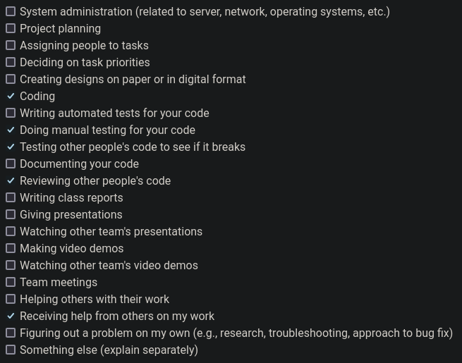

# Personal Log for Paul (Team 1)

## 📅 September 25, 2023 - October 1, 2023

### 📋 Tasks Completed

### 🎯 Work Summary

-   brainstorming features and breaking down tasks
-   refining tech stack
-   project plan document

### 🗒️ Additional Notes

No additional notes.

## 📅 October 2, 2023 - October 8, 2023

### 📋 Tasks Completed

### 🎯 Work Summary

-   started learning next.js and the react framework
-   started working on some temp files locally for the video processing backend
-   finalized some git workflow and documentation standards for our project

### 🗒️ Additional Notes

No additional notes.

## 📅 October 9, 2023 - October 15, 2023

### 📋 Tasks Completed

### 🎯 Work Summary

-   made improvements to the video processing backend
-   pushed changes to git on gh-12-* branch
-   looked at ER design and suggested changes during team meeting

### 🗒️ Additional Notes

No additional notes.

## 📅 October 16, 2023 - October 22, 2023

### 📋 Tasks Completed

-   #12 -> video upload endpoint

### 🎯 Work Summary

-   refined video processing server, broke it out into a class with a runnable main() method
-   added functionality for watching a folder and running processing jobs when new files are added
-   added functionality for http POST requests to start processing jobs
-   added full interpolated video processing integration with AWS rekognition
-   wrote some basic tests

### 🗒️ Additional Notes

No additional notes.

## 📅 October 23, 2023 - October 29, 2023

### 📋 Tasks Completed

-   #43 -> fixed a bug where ffmpeg wouldn't always run
-   #46 -> assisted in debugging permissions on video processing server build
-   #11 -> video upload ui

### 🎯 Work Summary

-   assisted Thuan with video processing build issues
-   worked on the backend server and fleshed out our Flask implementation
-   added tests for the Flask server and updated tests for the video processing server
-   made a draft video upload UI

### 🗒️ Additional Notes

No additional notes.

## 📅 October 30, 2023 - November 05, 2023

### 📋 Tasks Completed

-   #65 -> tests for video upload UI
-   #59 -> change python webserver framework

### 🎯 Work Summary

-   made presentation slides and script
-   tested live demo to make sure everything was working (though we didn't get to show it)
-   wrote tests for front end UI elements
-   started research into quart for a new python webserver framework

### 🗒️ Additional Notes

No additional notes.

## 📅 November 6, 2023 - November 12, 2023

### 📋 Tasks Completed

-   #59 -> migrate python http server to reactive/async framework
-   #77 -> implement python server backend to signal next.js that video processing is completed and user can review video

### 🎯 Work Summary

-   continued researching Quart as a replacement for our Python webserver framework
-   migrated web server to Quart and modified tests to work with an async framework
-   switched WSGI provider from gunicorn to uvicorn
-   implemented the python server backend to signal next.js when videos are finished processing

### 🗒️ Additional Notes

No additional notes.

## 📅 November 20, 2023 - November 26, 2023

### 📋 Tasks Completed

-   #45 -> fix a bug where video processing failed if a face went out of frame
-   #77 -> add communication for signalling next.js when a video is completed
-   #167 -> add quart api route for cancelling in-progress video processing

### 🎯 Work Summary

-   debugging some things with thuan resulting from review feature (#77) in quart
-   created a tracker class to keep track of multiple processes at once for the /process_status api route
-   modified interpolation code to handle faces going in and out of frame, or not existing at all
-   using tracker class created in features for #77, added an api route for cancelling in-progress video processing

### 🗒️ Additional Notes

No additional notes.

## 📅 November 27, 2023 - December 03, 2023

### 📋 Tasks Completed

-   #84 -> add /api/appointments endpoint for next.js
-   #221 -> tests for some quart server features

### 🎯 Work Summary

-   added an API route for next.js to allow appointments to be searched, created, and updated
-   added unit tests for some new quart features
-   recorded part of the design video, an overview of the quart server and a quick demo
-   assisted with design doc/video planning
-   lots of PR code review with front-end and container build features

### 🗒️ Additional Notes

No additional notes.

## 📅 January 8, 2024 - January 14, 2024

### 📋 Tasks Completed

### 🎯 Work Summary

-   attended team meeting and discussed our plan to restructure our system architecture in response to the client feedback
-   researched Lambda and S3 and started restructuring codebase to work in a serverless format
-   created preliminary testing Lambda function
-   researched and added dependency layer for Lambda
-   tested different methods of getting S3 objects to OpenCV VideoCaptures

### 🗒️ Additional Notes

No additional notes.

## 📅 January 15, 2024 - January 21, 2024

### 📋 Tasks Completed

-   #22 -> S3/Lambda/Rekognition integration

### 🎯 Work Summary

-   finished lambda code for video processing
-   improved memory efficiency by 3x while processing video with new 'chunking' interpolation
-   tested old vs new interpolation techniques to verify new method is better
-   wrote lambda image build script and created AWS ECR for container images
-   tested lambda end-to-end functionality
-   started working on #367

### 🗒️ Additional Notes

No additional notes.

## 📅 January 22, 2024 - January 28, 2024

### 📋 Tasks Completed

-   #361 -> update video upload api to work with lambda rather than quart server
-   #367 -> appointment list management UI for professional users

### 🎯 Work Summary

-   wrote docs for lambda build and deployment with detailed instructions on what parameters, environment variables, and permissions are necessary on AWS Lambda
-   rewrote video upload API endpoint to work with S3 instead of the quart server and removed redundant/deprecated code
-   wrote appointment management UI for professionals which included extending the /api/appointments API endpoint with a DELETE method
-   lots of code review and debugging, as well as reverting changes to the video upload API after multipart S3 uploads broke lambda functionality
-   team meetings and discussing necessary tasks to be completed for peer testing

### 🗒️ Additional Notes

No additional notes.

## 📅 January 29, 2024 - February 04, 2024

### 📋 Tasks Completed

-   #460 -> added api/lambda support for user selectable blurring regions

### 🎯 Work Summary

-   reviewing other people's code
-   consolidating peer review feedback and deciding on the next priorities
-   updated api/lambda to support user selectable blurring regions
-   started writing tests for my open PR on issue #367
-   started work on #469

### 🗒️ Additional Notes

No additional notes.

## 📅 February 5, 2024 - February 11, 2024

### 📋 Tasks Completed

-   #503 -> remove deprecated naming schema
-   #469 -> update video review API to cleanup S3 videos based on user response
-   #367 -> appointment management list and tests

### 🎯 Work Summary

-   rewrote #367 to be much cleaner and incorporate new db schema
-   found and brought up some consistency issues in team meeting
-   cleaned up some deprecated stuff (#503)
-   updated video review api (#469)
-   wrote tests for #367

### 🗒️ Additional Notes

No additional notes.

## 📅 February 12, 2024 - February 18, 2024

### 📋 Tasks Completed

-   #537 -> in-browser video recording
-   #469 -> video review api changes/updates

### 🎯 Work Summary

-   wrote front end for recording video in browser (#537 frontend)
-   developed a lambda that ran a MediaConvert job before refactoring it into a lambda that runs ffmpeg locally for converting video formats (#537 backend)
-   wrote docs and Makefile/Dockerfile/ECR CI for this lambda, then deployed it and tested
-   implemented some mid-large changes to #469
-   solved one of the test issues with appointment management, found a new one where dates seem to be rendered differently on gh actions vs locally that I need to investigate

### 🗒️ Additional Notes

Just want to state that yes, MediaConvert exists. Yes, we could have stuck with a Lambda that ran a MediaConvert job. However, this would have led to major issues with metadata since AWS MediaConvert doesn't pass on object metadata and AWS S3 doesn't support editing metadata, so the MediaConvert Lambda would have had to busy wait while waiting and checking for the MediaConvert job to finish before downloading the output file and re-uploading with correct metadata before deleting the original files. We had a discussion and decided it would be more efficient to simply run ffmpeg locally on the Lambda rather than being billed for busy waiting + the MediaConvert job.

## 📅 February 26, 2024 - March 03, 2024

### 📋 Tasks Completed

-   #609 -> get appointment metadata
-   #642 -> minor change to fix a redirect url on appointment management ui
-   #645 -> redirect to /user/appointments after reviewing a video

### 🎯 Work Summary

-   lots of reviewing other people's code
-   found a bug with the lambda that I need to investigate, seems to randomly crash with some recorded (not uploaded) videos
-   helped Linh with some issues she was having while working on 2 of her PRs
-   lots of minor integration and QOL fixes

### 🗒️ Additional Notes

No additional notes.

## 📅 March 04, 2024 - March 10, 2024

### 📋 Tasks Completed

-   #648 -> change weird and inconsistent naming scheme for recorded videos
-   #654 -> fix edge case that caused lambda to crash seemingly randomly
-   #659 -> lots of minor UI/UX changes for `/staff`'s page.tsx
-   #663 -> change UI for better UX on action complete for review page
-   #665 -> fixed server action redirecting to `/user`, should be dependant on user's role
-   #669 -> fix appointment ID being hardcoded into review page
-   #667 -> user selectable blurring regions
-   #675 -> update face blurring to blur any/all faces in video

### 🎯 Work Summary

-   lots of reviewing other people's code for Peer Testing #2
-   many UI/UX changes and bugfix PRs for Peer Testing #2 (see issues mentioned above)
-   helped Ngan figure out that the React component we use for user-selectable regions doesn't return pixel values but rather width/height percentages that need to be scaled by the native video resolution, and finished up Ngan's work on user-selectable regions by fixing some bugs with how the canvas wrapped the <video/> tag with weird extra spaces that threw off region y-accuracy (check branch gh-667-user-blurring-region-ui). Ngan did all the scaffolding and most of the work for this feature, I just helped with the finishing up of it and minor bugfixes.
-   re-write interpolation on video-processing to use all faces Rekognition returns. This involved writing a 'matching' function to determine which start faces for each frame chunk belonged to which end faces for that frame chunk, which itself required a sortable class to contain and manage matches and their respective distances (scores, if you will).

### 🗒️ Additional Notes

No additional notes.

## 📅 March 11, 2024 - March 17, 2024

### 📋 Tasks Completed

-   #459 -> add tests for new functionality of video processing lambda
-   #706 -> add UI/UX improvements as well as backend functionality for user account information updating

### 🎯 Work Summary

-   spent some time learning how mocking works in Python's unittest framework
-   updated tests for video processing module to include new functionality
-   updated UI/UX for user update information page (eg removed browser alerts in favour of patternfly <Alert/> components and added phone number validation)
-   added backend cognito function and API route for user information updating and manually tested

### 🗒️ Additional Notes

No additional notes.

## 📅 March 18, 2024 - March 24, 2024

### 📋 Tasks Completed

-   #706 -> try to add session variable updating

### 🎯 Work Summary

-   researched NextAuth and tried multiple implementations of 2 separate methods of updating the session variables for my open PR (#712)
-   one method required some page/app files that just don't seem like they mesh with how our project is structured (pages/_app.js layouts)
-   the other method which used NextApiRequests with the NextAuth JWT callbacks passed an undefined query for reasons I can't figure out and also somehow corrupted the token despite my code not even modifying it yet
-   still couldn't figure out a way to make it work even talking with Ngan about it, I'll likely have to ask Connor about it
-   attended meetings and learned more about Helm and k8s from Thuan's team presentation
-   spent a lot of time finishing up the review on Thuan's 2,000 line helm chart PR (#25)

### 🗒️ Additional Notes

No additional notes.

## 📅 March 25, 2024 - March 31, 2024

### 📋 Tasks Completed

-   #706 -> complete adding session updating
-   #761 -> back button shouldn't be shown on the `/` page
-   #769 -> several small UX improvements

### 🎯 Work Summary

-   Ngan overhauled the whole session and auth flow in a different PR which fixed most of the issues I was having previously, after merging her changes in and refactoring a bit got everything to work for #706
-   lots of little UI/UX polishing things. fixed the back button showing up on the home page `/`, fixed the login page still being accessible after logging in via manually typing the URL, and improved the filter UX by casting all values to lowercase so that filters are case insensitive.
-   started work on an updated navbar that includes role-specific links to pages/actions users can do (check out draft PR #778). Links are styled like the back button that's also on the navbar, and middleware + the welcome page have been updated to redirect to `/{userrole}/appointments` rather than just `/{userrole}`. However, this may not be the final implementation as we had a bit of a miscommunication and Ngan was also working on an updated navbar as well.

### 🗒️ Additional Notes

No additional notes.

## 📅 April 1, 2024 - April 7, 2024

### 📋 Tasks Completed

-   #695 -> improve the blurring function
-   #759 -> update Lambda readmes
-   #812 -> fix how zooming in on the welcome page would break some text
-   #817 -> add email validation to the feedback form on the home page

### 🎯 Work Summary

-   updated the video processing blurring function to do a mosaic blur rather than a simple Gaussian blur for improved privacy
-   update both Lambda readmes with screenshots so it's better developer experience to follow the steps required to deploy the Lambdas
-   fixed a UI issue where zooming in to the home page would have some of the text hide under the top navigation bar.
-   added email form validation to the feedback form so that users can't put in invalid emails
-   some hotfixes and lots of testing on Sunday, the day of the final deployment
-   worked on my video demo and final report

### 🗒️ Additional Notes

bye Kevin, love you :)
