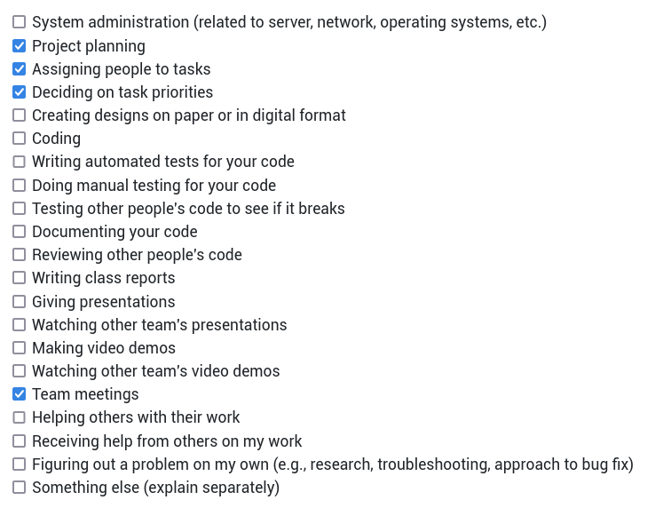
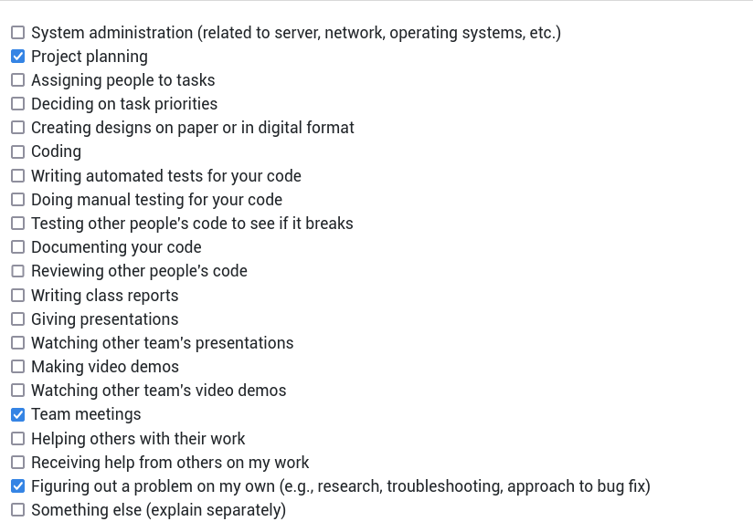
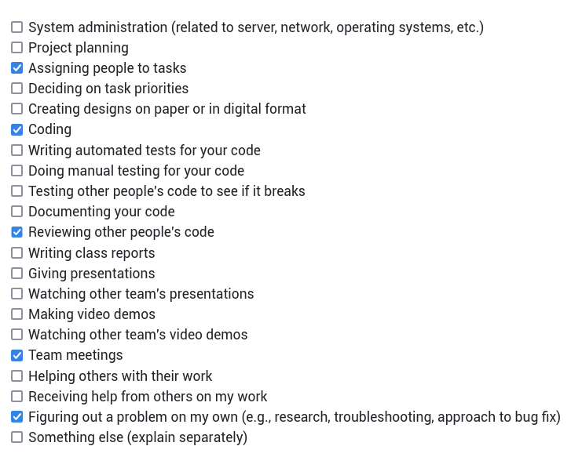
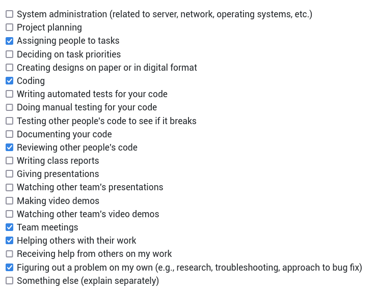
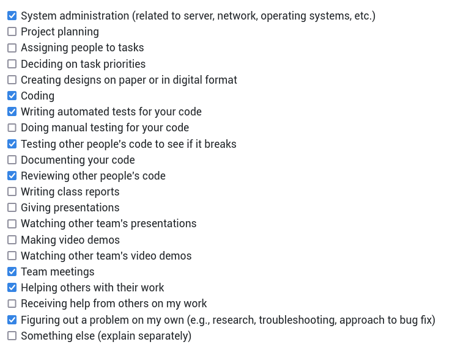
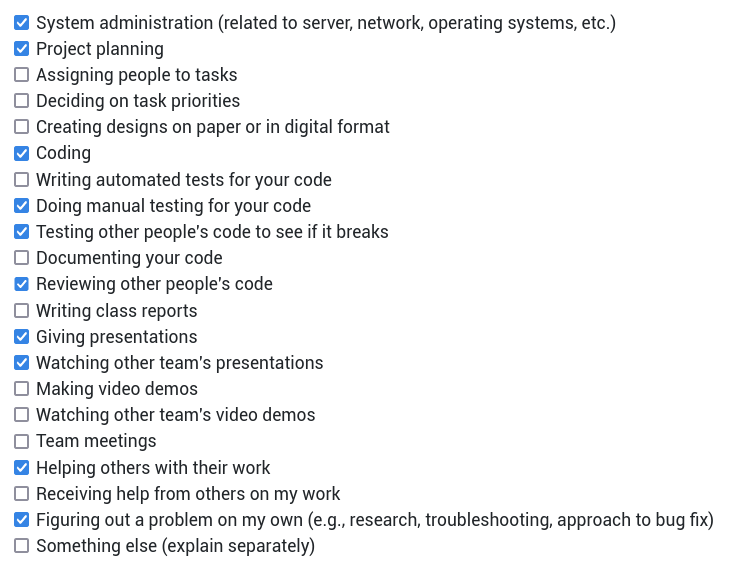
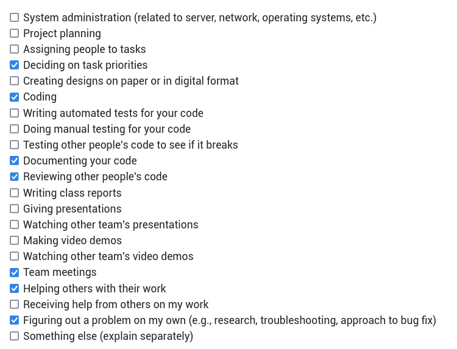
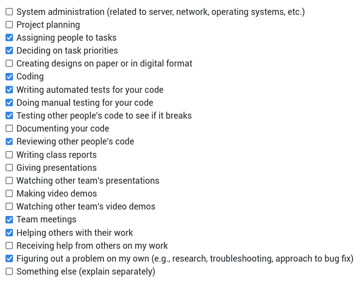
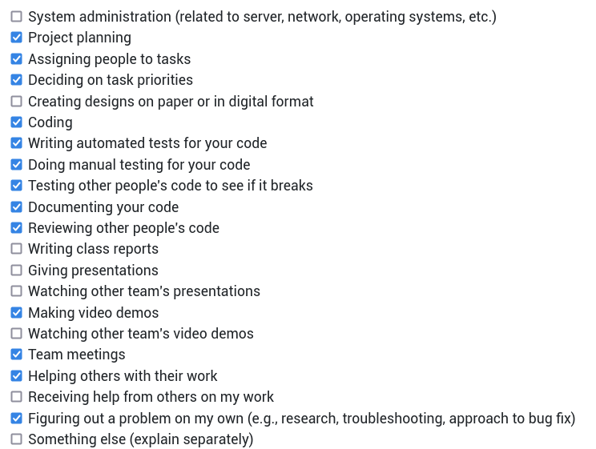
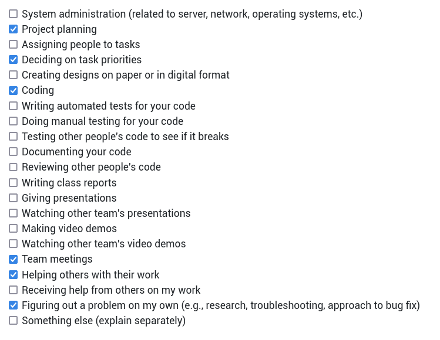

# Personal Log for Thuan_vo (Team 1)

## 📅 September 25, 2023 - October 1, 2023

### 📋 Tasks Completed

### 🎯 Work Summary

- Brainstorm project architectures.
- Refine tech stack for deployment (i.e. k8s).
- Attend meetings.
- Look into container image builds for Next.js.

### 🗒️ Additional Notes

No additional notes.

## 📅 October 2, 2023 - October 8, 2023

### 📋 Tasks Completed

### 🎯 Work Summary

- Discussion github workflows and git conventions.
- Attend meetings.
- Look into container image builds for Next.js.
- Research into operatorSDK and local development setup.

### 🗒️ Additional Notes

No additional notes.

## 📅 October 9, 2023 - October 15, 2023

### 📋 Tasks Completed

### 🎯 Work Summary

- Researched and composed a container file to build the image with Next.js.
- Looked into Amazon Elastic Container Registry to host container images.
- Continued researching OpenShift provisioning on AWS.
- Attended meetings.

### 🗒️ Additional Notes

No additional notes.

## 📅 October 16, 2023 - October 22, 2023

### 📋 Tasks Completed

### 🎯 Work Summary

- Continue looking into Amazon Elastic Container Registry to host container images.
- Continued researching OpenShift provisioning on AWS.
- Reviewed video processing server scaffold.
    - Will need to research on how to pass AWS SSO secrets to containers.
    - Will look into container image build for video processing server.
- Reviewed test framework for web application with Jest.
- Worked with Ngan to research on database init setup and ORM plugins.
- Attended meetings.

### 🗒️ Additional Notes

No additional notes.

## 📅 October 23, 2023 - October 30, 2023

### 📋 Tasks Completed

### 🎯 Work Summary

- Updated development scripts with Makefile
  - Include targets to build and run container images.
  - Finish for NextJS + Video Processing Server.
- Added a simple CI to run tests on push and PRs.
- Helped build database initialization image.
  - Need to find a way to install prisma CLI instead npx.
- Reviewed test frameworks.

### 🗒️ Additional Notes

No additional notes.

## 📅 October 30, 2023 - November 05, 2023

### 📋 Tasks Completed

### 🎯 Work Summary

- Helped Ngan with building databae init image.
  - Need to research into how to push initial rows into User table (basic auth).
- Added compose file to run all services as a smoketest.
  - Compose tool must be `v2`+. Otherwise, `depends_on` new syntax won't be not supported.
  - Will extend smoketests with k8s yamls.
- Added some CIs to test service tests (i.e. nextjs & video processor).
  - No tests currently for database.
  - Will need to look into integration tests next.
- Added some CIs to validate PR semantics.
  - PR title, labels, referenced issues/PR.
- Team meetings.
- Mini presentation on Tuesday.

### 🗒️ Additional Notes

No additional notes.

## 📅 November 06, 2023 - November 12, 2023

### 📋 Tasks Completed

### 🎯 Work Summary

- Restructured the project directories.
  - `front-end` nows becomes `web`. Database stays the same within `web`.
  - `video-processing` is moved out of `back-end`, which is removed.
- Added CI to run container image builds on push to `develop`, and `main`/`master`.
- Set up dependabot configurations.
  - Got a little hiccup with target branch as depdendabot targets default branch. Updated to target `develop` branch.
- Made release `0.1.0-alpha.1` including works since start.
  - Release `0.1.0-alpha.2` is also out to fix dependabot issues above.
- Added some docs on instructions to pull container images from `ghcr.io` now that all images are published.
- Helped Linh set up `podman`.
- Team meetings.

### 🗒️ Additional Notes

Reading break next week. Work hours will be limited.

## 📅 November 13, 2023 - November 26, 2023

### 📋 Tasks in progress

### 🎯 Work Summary

- Added entrypoint script to initialize database.
  - Client must specify a csv file to mount in the init container if using Basic Auth. The content will be used to generate an SQL statement that populates the `User` table.
  - Need more research to handle existing data.
- Optimized image build for video processor.
  - Added a `base` stage to setup common base image and reorder instructions for better caching.
  - CI builds continue to freshly build the image. This is desired.
- Added workflow steps to cache CI dependencies (i.e. npm, pip) for reduce execution times.
- Applied flake8 fixes for video processing component.
  - Run into a hidden bug where sub-processes shutdowns the server when receiving `SIGTERM`.
  - Turned out overwriting the signal handler solved the problem nicely.
- Added `sharp` for image (i.e. graphic) optimization when building NextJS app.
- Reviewed dependabot's updates.
- Prepared `0.1.0-alpha.3` release to bring caches into default branch and add license to the project.
- Team meetings.

### Additional Notes

No additional notes.

## 📅 November 27, 2023 - December 3, 2023

### 📋 Tasks in progress

### 🎯 Work Summary

- Review dependabot dependency upgrades.
  - New CVE (CVE-2023-48631) detected with `@adobe/css-tools`. PR for the fix is now merged in `develop`.
  - Upgraded prisma to `5.6.0` in `/app/web/db` to match that in `/app/web`.
  - Removed unused dependencies in video processing component.
- Updated broken compose files in smoketest.
- Implemented video review endpoint to upload to S3.
  - Will continue to look into Localstack to avoid acessing actual AWS service (i.e. save costs).
- Reviewed e2e test framework with Cypress.
  - Cypress Cloud might need to be set up to run test in parallel using github action matrix.
  - Need to set up workflow to run Cypress e2e tests on CI.
- Worked on the component video for 5-minute design video.
- Team meetings.

### Additional Notes

Final exams start next week. Work hours will be minimal. Resume in January.

## 📅 January 8, 2024 - January 14, 2024

### 📋 Tasks in progress

### 🎯 Work Summary

- Team meetings.
- Researched into ACK Controller to automate Lambda and RDS instance provisioning.
  - AWS credentials are always a headache but EKS would help easy the work but that would also mean self-host k8s/ocp would be not supported (at least at the moment).
  - Will try with self-host k8s/ocp. If everything checks out, then mostly just us misunderstanding AWS IAM.
- Looked into lambda container image build.
  - Will need to check rootless support next week.
- Will start scaffolding k8s operator.
  - There are many choices but Golang operator would be the most flexible and extensible.

### Additional Notes

No additional notes.
