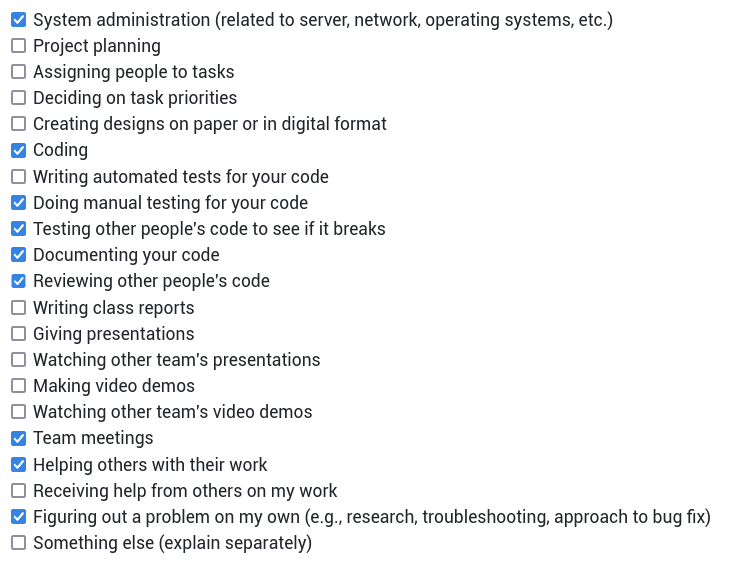

# Personal Log for Thuan_vo (Team 1)

## 📅 September 25, 2023 - October 1, 2023

### 📋 Tasks Completed

### 🎯 Work Summary

- Brainstorm project architectures.
- Refine tech stack for deployment (i.e. k8s).
- Attend meetings.
- Look into container image builds for Next.js.

### 🗒️ Additional Notes

No additional notes.

## 📅 October 2, 2023 - October 8, 2023

### 📋 Tasks Completed

### 🎯 Work Summary

- Discussion github workflows and git conventions.
- Attend meetings.
- Look into container image builds for Next.js.
- Research into operatorSDK and local development setup.

### 🗒️ Additional Notes

No additional notes.

## 📅 October 9, 2023 - October 15, 2023

### 📋 Tasks Completed

### 🎯 Work Summary

- Researched and composed a container file to build the image with Next.js.
- Looked into Amazon Elastic Container Registry to host container images.
- Continued researching OpenShift provisioning on AWS.
- Attended meetings.

### 🗒️ Additional Notes

No additional notes.

## 📅 October 16, 2023 - October 22, 2023

### 📋 Tasks Completed

### 🎯 Work Summary

- Continue looking into Amazon Elastic Container Registry to host container images.
- Continued researching OpenShift provisioning on AWS.
- Reviewed video processing server scaffold.
    - Will need to research on how to pass AWS SSO secrets to containers.
    - Will look into container image build for video processing server.
- Reviewed test framework for web application with Jest.
- Worked with Ngan to research on database init setup and ORM plugins.
- Attended meetings.

### 🗒️ Additional Notes

No additional notes.

## 📅 October 23, 2023 - October 30, 2023

### 📋 Tasks Completed

### 🎯 Work Summary

- Updated development scripts with Makefile
  - Include targets to build and run container images.
  - Finish for NextJS + Video Processing Server.
- Added a simple CI to run tests on push and PRs.
- Helped build database initialization image.
  - Need to find a way to install prisma CLI instead npx.
- Reviewed test frameworks.

### 🗒️ Additional Notes

No additional notes.

## 📅 October 30, 2023 - November 05, 2023

### 📋 Tasks Completed

### 🎯 Work Summary

- Helped Ngan with building databae init image.
  - Need to research into how to push initial rows into User table (basic auth).
- Added compose file to run all services as a smoketest.
  - Compose tool must be `v2`+. Otherwise, `depends_on` new syntax won't be not supported.
  - Will extend smoketests with k8s yamls.
- Added some CIs to test service tests (i.e. nextjs & video processor).
  - No tests currently for database.
  - Will need to look into integration tests next.
- Added some CIs to validate PR semantics.
  - PR title, labels, referenced issues/PR.
- Team meetings.
- Mini presentation on Tuesday.

### 🗒️ Additional Notes

No additional notes.

## 📅 November 06, 2023 - November 12, 2023

### 📋 Tasks Completed

### 🎯 Work Summary

- Restructured the project directories.
  - `front-end` nows becomes `web`. Database stays the same within `web`.
  - `video-processing` is moved out of `back-end`, which is removed.
- Added CI to run container image builds on push to `develop`, and `main`/`master`.
- Set up dependabot configurations.
  - Got a little hiccup with target branch as depdendabot targets default branch. Updated to target `develop` branch.
- Made release `0.1.0-alpha.1` including works since start.
  - Release `0.1.0-alpha.2` is also out to fix dependabot issues above.
- Added some docs on instructions to pull container images from `ghcr.io` now that all images are published.
- Helped Linh set up `podman`.
- Team meetings.

### 🗒️ Additional Notes

Reading break next week. Work hours will be limited.

## 📅 November 13, 2023 - November 26, 2023

### 📋 Tasks in progress

### 🎯 Work Summary

- Added entrypoint script to initialize database.
  - Client must specify a csv file to mount in the init container if using Basic Auth. The content will be used to generate an SQL statement that populates the `User` table.
  - Need more research to handle existing data.
- Optimized image build for video processor.
  - Added a `base` stage to setup common base image and reorder instructions for better caching.
  - CI builds continue to freshly build the image. This is desired.
- Added workflow steps to cache CI dependencies (i.e. npm, pip) for reduce execution times.
- Applied flake8 fixes for video processing component.
  - Run into a hidden bug where sub-processes shutdowns the server when receiving `SIGTERM`.
  - Turned out overwriting the signal handler solved the problem nicely.
- Added `sharp` for image (i.e. graphic) optimization when building NextJS app.
- Reviewed dependabot's updates.
- Prepared `0.1.0-alpha.3` release to bring caches into default branch and add license to the project.
- Team meetings.

### Additional Notes

No additional notes.

## 📅 November 27, 2023 - December 3, 2023

### 📋 Tasks in progress

### 🎯 Work Summary

- Review dependabot dependency upgrades.
  - New CVE (CVE-2023-48631) detected with `@adobe/css-tools`. PR for the fix is now merged in `develop`.
  - Upgraded prisma to `5.6.0` in `/app/web/db` to match that in `/app/web`.
  - Removed unused dependencies in video processing component.
- Updated broken compose files in smoketest.
- Implemented video review endpoint to upload to S3.
  - Will continue to look into Localstack to avoid acessing actual AWS service (i.e. save costs).
- Reviewed e2e test framework with Cypress.
  - Cypress Cloud might need to be set up to run test in parallel using github action matrix.
  - Need to set up workflow to run Cypress e2e tests on CI.
- Worked on the component video for 5-minute design video.
- Team meetings.

### Additional Notes

Final exams start next week. Work hours will be minimal. Resume in January.

## 📅 January 8, 2024 - January 14, 2024

### 📋 Tasks in progress

### 🎯 Work Summary

- Team meetings.
- Researched into ACK Controller to automate Lambda and RDS instance provisioning.
  - AWS credentials are always a headache but EKS would help easy the work but that would also mean self-host k8s/ocp would be not supported (at least at the moment).
  - Will try with self-host k8s/ocp. If everything checks out, then mostly just us misunderstanding AWS IAM.
- Looked into lambda container image build.
  - Will need to check rootless support next week.
- Will start scaffolding k8s operator.
  - There are many choices but Golang operator would be the most flexible and extensible.

### Additional Notes

No additional notes.

## 📅 January 15, 2024 - January 21, 2024

### 📋 Tasks in progress

### 🎯 Work Summary

- Team meetings.
- Helped Paul with AWS Lambda deployment of the video processor.
  - Outlined the steps for lambda container image build. This image is used as a source for lambda source code. This is approriate as we can avoid shipping a separate lambda zip file.
  - Since the image is not used for launching lambda, there is no need for rootless configurations.
  - The lambda image currently requires manual build and push to ECR. Will need to look into configuring Github CI for this task.
  - New lambda implememtation seems to also resolve the problem with oversized output videos. Not sure why but will continue to monitor.
- Continued to research into mananging AWS resources from Kubernetes and OpenShift.
  - Successfully installed ACK controllers on EKS. EKS already set ups STS for us so we will recommend end users to use it for Kubernetes.
  - For OpenShift, additional configurations must be done for non-AWS clusters. AWS Rosa seems to also have STS configured. Will start provisioning and try installing ACK controllers.
- Brain-stormed specifications for web server's health check.
  - This requires checks for database connection, S3 connection + approriate permissions (i.e. full CRUD), and lambda availability.
  - This endpoint poses a security if exposed unauthenticated. However, Kubernetes health probes cannot specify authentication. One solution can be ignoring auth for localhost (i.e. configurable).
- Reviewed dependabot updates.
### Additional Notes

No additional notes.

## 📅 January 22, 2024 - January 28, 2024

### 📋 Tasks in progress

### 🎯 Work Summary

- Team meetings.
- Update Github workflow to push container images to Elastic Container Registry (ECR).
  - Since Lambda image must be available on ECR, our images should also be hosted there to avoid the need for maintenance in 2 places (i.e. ghcr.io and ecr)
  - This requires setting up AWS OIDC for Github and IAM role for action (i.e. pull/push to a private ECR repository)
- Provisioned ROSA Openshift.
  - Sent a quote increase for on-demand EC2 instances and got accepted by AWS team.
  - Installed ROSA cluster and started installing ACK Controllers. This requires configuring additional trust policy for ROSA OIDC.
  - Will start creating access to team members to the cluster once its fully ready.
  - No longer need to manually install OpenShift.
- Started on Helm Chart for the application.
  - Chart is almost ready, waiting on backend to integrate new changes into application deployment template.
  - Some planned automated steps are left out for simplicity. Will go back later to update if there is time.
- Bumped prisma to `5.8.1` following prisma-client upgrades.
- Reviewed PRs.

### Additional Notes

No additional notes.

## 📅 January 29, 2024 - February 4, 2024

### 📋 Tasks in progress

### 🎯 Work Summary

- Team meetings.
- Deprecated old implementation of video processor (i.e. with Quart).
  - Removed container image build CI for this component. Old images are also removed.
  - Source codes and build scripts are still available but not maintained.
- Updated local smoketest to accomodate new updates to the application.
  - This update also bringed (best efforts) more seamless and portable dev environment across OSes.
- Helped Ngan implement video fetching endpoints with AWS S3 presigned URLs.
- Helped Linh fix NextJS's error on missing `sharp` dependencies.
  - The actual reason is still unknown but fixed by manually point Next to `sharp`.
- Continued to work Helm Chart for the application.
  - Almost ready. Mostly waiting on any updates to the application.
- Reviewed Dependabot updates.
- Reviewed others' PRs.

### Additional Notes

Will be unavailable during midterm break (out of town to Toronto). Will try to finish up remaning high-priority tasks.

## 📅 February 5, 2024 - February 11, 2024

### 📋 Tasks in progress

### 🎯 Work Summary

- Team meetings.
- Continued to work Helm Chart for the application.
  - Networking needed some adjustments.
  - Did research on load balancing in AWS EKS.
  - Removed basic auth support (team plans).
- Added github workflow to check license headers.
- Added missing `node_modules` caches.
  - This should help reduce the CI run times.
- Prepared pre-release alpha.4.
- Reviewed Dependabot updates.
- Reviewed others' PRs.
- Provisioned a remote desktop for Linh with AWS workspaces.

### Additional Notes

No additional notes.

## 📅 February 12, 2024 - February 18, 2024

### 📋 Tasks in progress

### 🎯 Work Summary

- Team meetings.
- Continued to work on Helm Chart for the application.
  - Will do the final smoketest this week. Hopefully, ready soon.
  - Will also need to generate notes to inform users of post-installation steps.
- Created pre-release alpha.4.
  - Major highlights include deprecation of old system design from term 1.
- Set up unit and integration tests for database initializer.
  - Unit test covers entrypoint script.
  - Integration tests validate schema generation. Tools: Jest, testcontainers.
- Reviewed Dependabot updates and others' PRs.
- Fixed broken podman installation for Linh's remote desktop.
  - UID and GID range was not enough to run rootless.

### Additional Notes

Mostly off during reading break.

## 📅 February 26, 2024 - March 03, 2024

### 📋 Tasks Completed

### 🎯 Work Summary

- Team meetings.
- Finished Helm Chart implemetations.
  - Fixed ingress objects and marked it as required (only supported mode).
  - Fixed RDS-related objects specs. Some specs are not valid, but not caught by schema validation.
  - Added TLS support. This is a hard requirement.
  - Tested deployment scenarios with custom domain and Load Balancer domain (with self-signed certificates).
- Reviewed others' PRs.
- Reviewed dependabot's PRs.

### Additional Notes

No additional notes.

## March 3, 2024, - March 10, 2024

### Work Summary

- Team meetings.
- Reviewed others' PRs.
- Reviewed dependabot's PRs.
  - Dependencies for region selector are outdated.
  - Will check the build once Connor finished forking and reimplementing the project to be compatible with React 18 and TS.
- Helped with peer testing.
- Started initial QA process for the product.
  - Added unit tests for concersion lambdas.
  - Will move on to processing lambda.
  - Intergration tests require additional research as we likely do not want to run them on github CI, but AWS infrastructure. Same for 2e2 tests.
  - Will start constructing QA report once all tests are implemented.
- Still awaiting reviews for Helm Chart.

### Additional Notes

No additional notes.

## March 10, 2024 - March 17, 2024

### Work Summary

- Team meetings.
- Reviewed others' PRs.
- Reviewed dependabot's PRs.
- Still awaiting reviews for Helm Chart.
- Finished unit tests for lambda handlers for video processing and conversion. Below is the current coverage for the tests.
  - Exception cases (bad scenarios) are still missing and required for QA.
  - Resolving certain issues with mocks failing on Github CI.

### Additional Notes

No additional notes.
