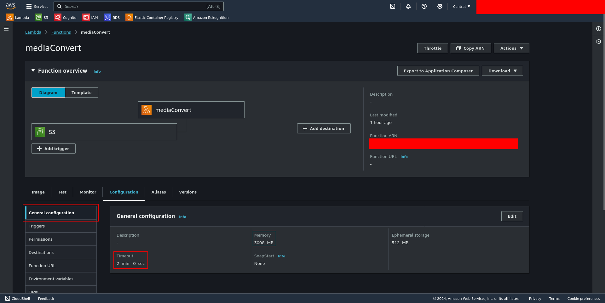

# PrivacyPal Video Conversion

Created with Python, AWS Lambdas, and ffmpeg. Used to convert in-browser recorded *.webm videos to processable *.mp4 videos.

## Build and push to ECR:
First, ensure you are logged in with AWS SSO. Then, run the following:
```bash
cd app/video-conversion
make lambda-oci-build lambda-oci-push
```

## Lambda configuration on AWS

### Deployment:
When a new image is pushed to the ECR, you need to manually deploy the lambda function using the new image. Go to Lambda -> Functions -> functionName -> Image -> Deploy new image. Select the latest image from the ECR and deploy.


Note: this shouldn't change any configurations you've made in the past but double check your config after re-deploying as I've had some settings get removed for unknown reasons.

### General configuration:
At Lambda -> Functions -> functionName -> Configuration -> General configuration, you should set the following configurations:

|Configuration|Value|
|--|--|
|Timeout|2 minutes|
|Memory|3008MB|



### Trigger:
The lambda is triggered by S3 bucket uploads. To set the trigger and the specific bucket(s) you wish to trigger the lambda with, go to Lambda -> Functions -> functionName -> Add trigger. The bucket can be any bucket you wish, but the event type should be `s3:ObjectCreated:*`. This lambda should only be triggered on `*.webm` file uploads, so add '.webm' to the suffix field in the trigger configuration.


### Required permissions/roles:
The lambda requires certain permissions to access required AWS services. These permissions can be configured at Lambda -> Functions -> functionName -> Configuration -> Permissions. The action type permissions required are:
 - `s3:*`


There is also an AWS CloudWatch permission that is generated automatically, this is necessary to keep if you wish to debug any future potential problems with the lambda.
