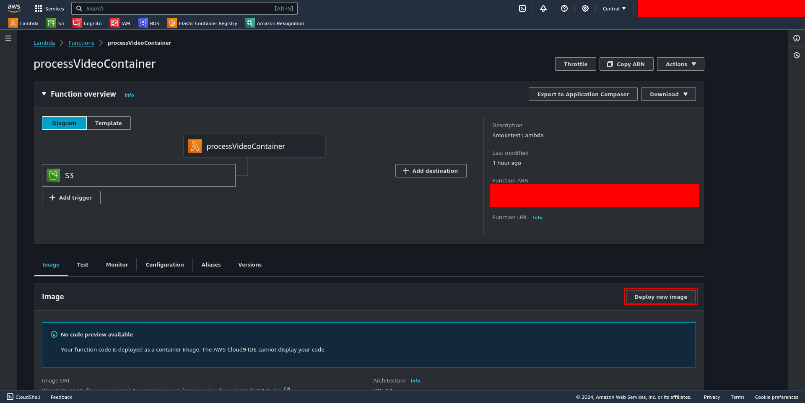
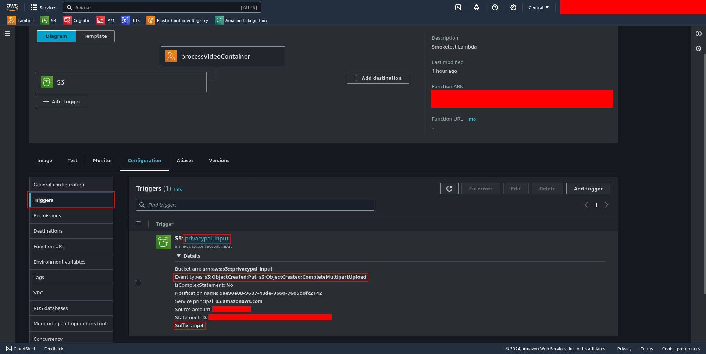
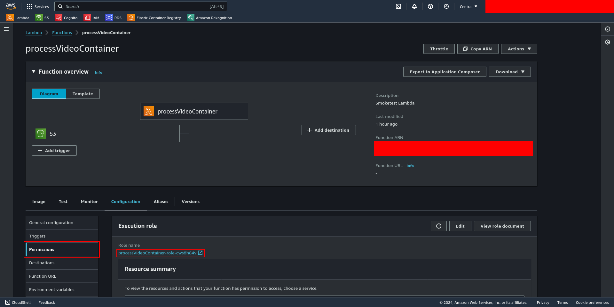
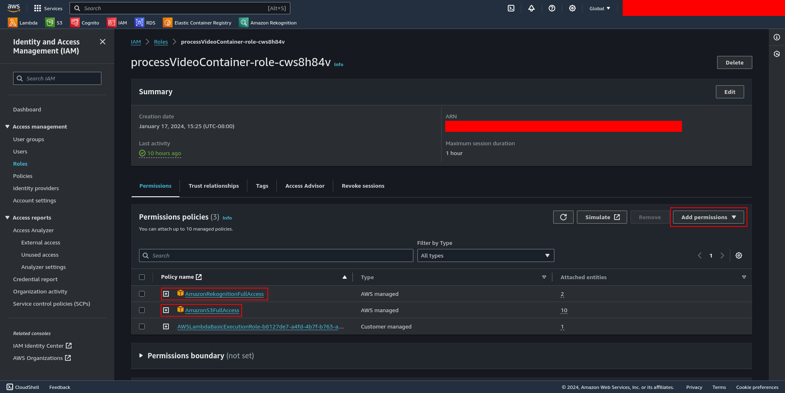

# PrivacyPal Video Processing

Created with Python, opencv, AWS Lambdas, and AWS Rekognition. Lambda's source images are built and hosted on AWS Elastic Container Registry for deployment.

## Build and push to ECR:
First, ensure you are logged in with AWS SSO. Then, run the following:
```bash
cd app/video-processing
make lambda-oci-build lambda-oci-push
```

## Lambda configuration on AWS

### Deployment:
When a new image is pushed to the ECR, you need to manually deploy the lambda function using the new image. Go to Lambda -> Functions -> functionName -> Image -> Deploy new image. Select the latest image from the ECR and deploy.



Note: this shouldn't change any configurations you've made in the past but double check your config after re-deploying as I've had some settings get removed for unknown reasons.

### General configuration:
At Lambda -> Functions -> functionName -> Configuration -> General configuration, you should set the following configurations:

|Configuration|Value|
|--|--|
|Timeout|15 minutes|
|Memory|3008MB|


### Trigger:
The lambda is triggered by S3 bucket uploads. To set the trigger and the specific bucket(s) you wish to trigger the lambda with, go to Lambda -> Functions -> functionName -> Add trigger. The bucket can be any bucket you wish, but the event type should typically be `s3:ObjectCreated:*`. This lambda should only be triggered on `*.mp4` file uploads, so add '.mp4' to the suffix field in the trigger configuration.



### Environment variables:
The lambda expects a variable with the key `OUTPUT_BUCKET` and the value being the name of your output S3 bucket you allow the lambda access to. This determines which bucket the lambda will attempt to upload the processed videos. Configure this variable at Lambda -> Functions -> functionName -> Configuration -> Environment variables.


### Required permissions/roles:
The lambda requires certain permissions to access required AWS services. These permissions can be configured at Lambda -> Functions -> functionName -> Configuration -> Permissions. The action type permissions required are:
 - `rekognition:*`
 - `s3:*`




There is also an AWS CloudWatch permission that is generated automatically, this is necessary to keep if you wish to debug any future potential problems with the lambda.
