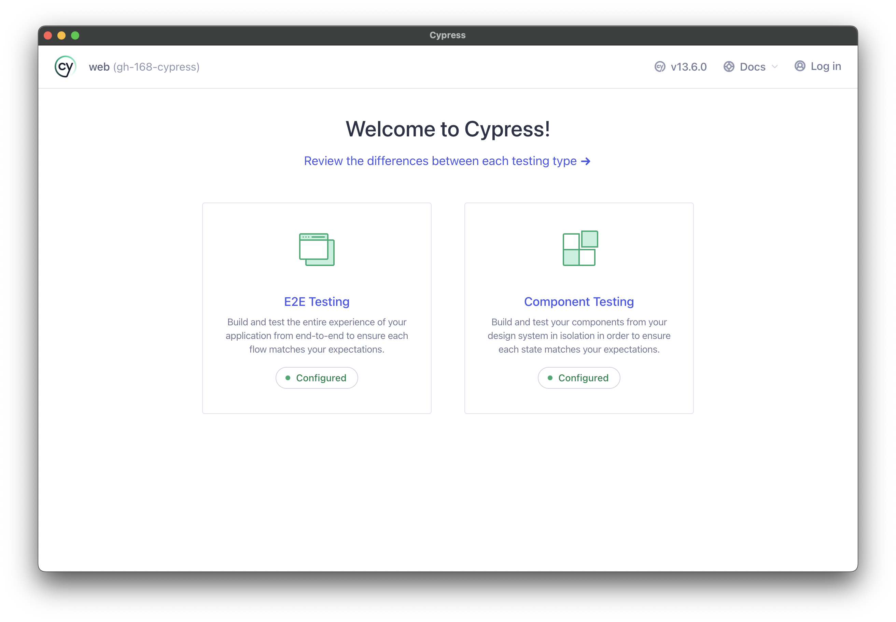
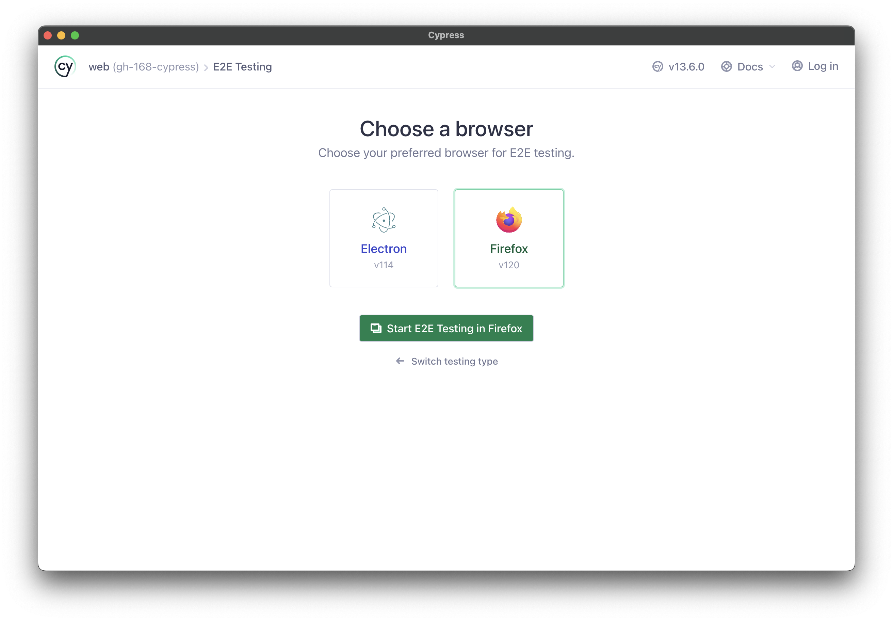
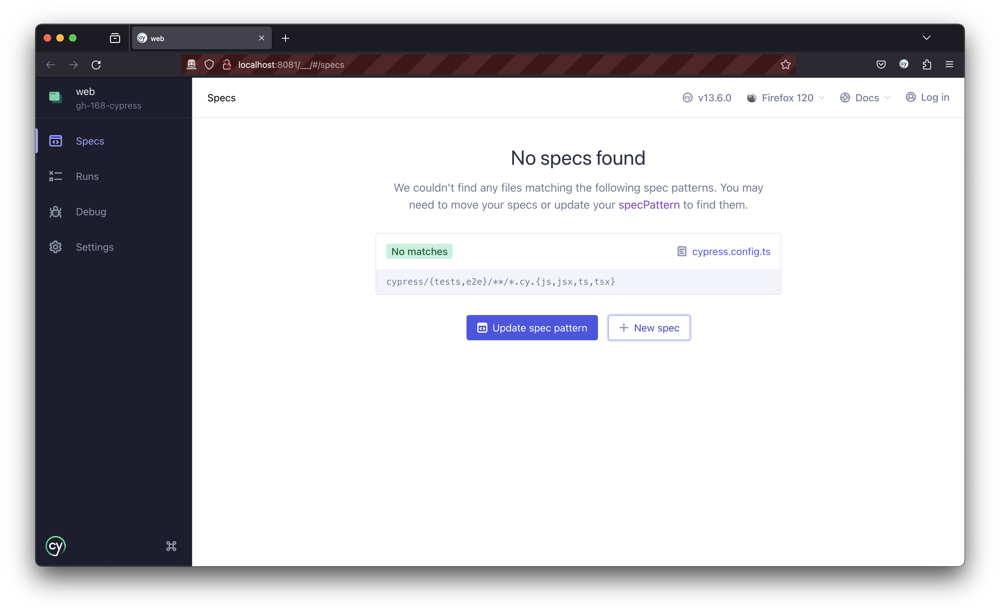
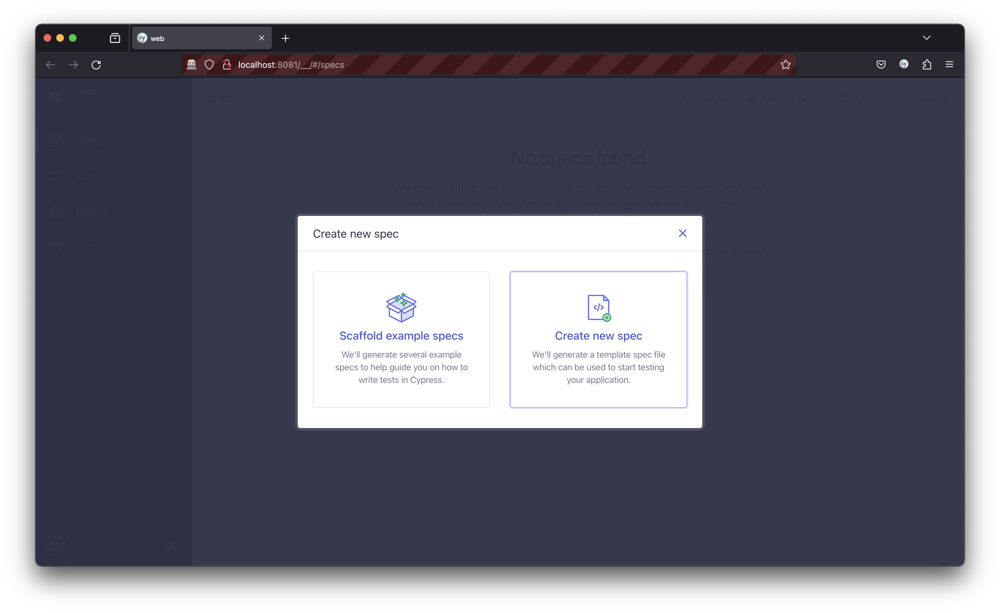
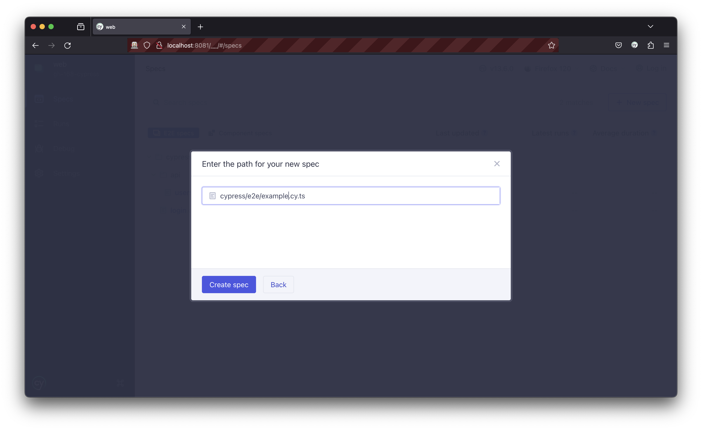
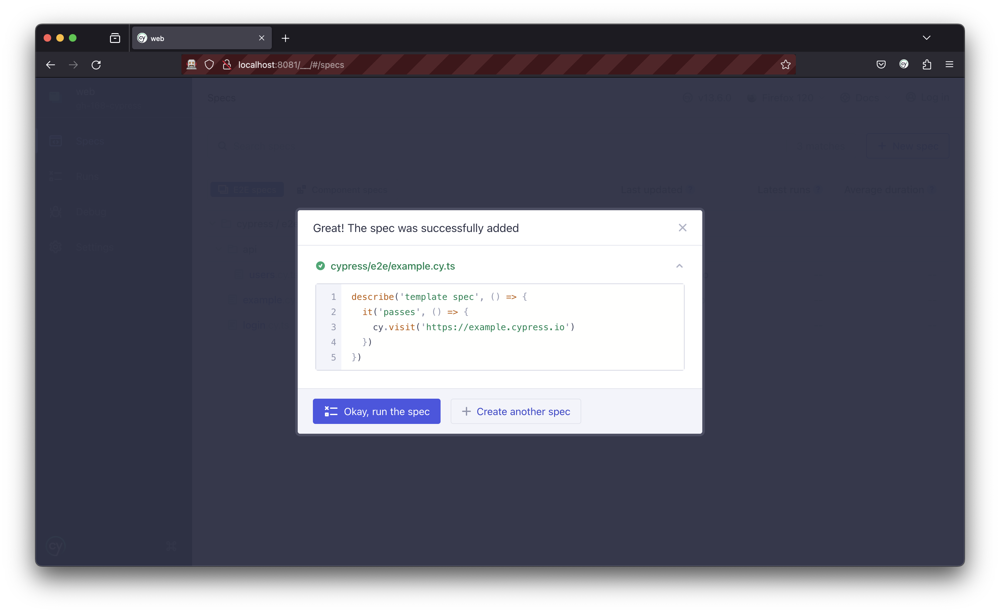
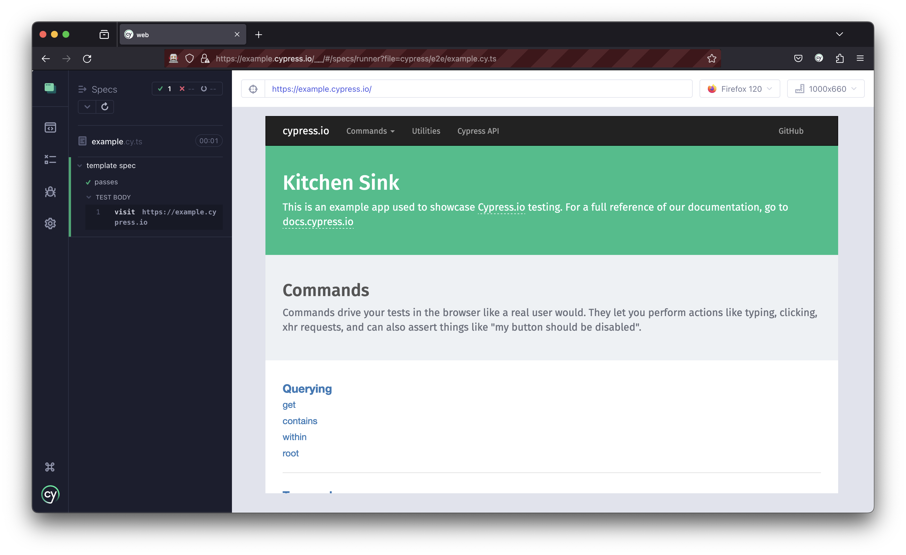

# Cypress E2E and Integration Testing

_Before you being, make sure to run `npm install`, `bash ./generate_dev_env.sh`, and followed the instructions in `app/web/db/README.md`._

Next.js will need to be running in development mode for Cypress to work:

```bash
npm run start:dev
```

## Running Cypress

Cypress tests are most easily run through a GUI. Since this is an E2E testing framework, you will also need a compatible web browser installed. Firefox or Chrome are recommended. Safari is not supported.

To open the Cypress GUI, run:

```bash
npm run cypress:open
```

This will first open Cypress, which first asks you what kind of test you want to run: E2E or Component. Due to the nature of Next.js and Server Side Rendering, we cannot run Component tests. Select E2E.



Next, Cypress will ask you which browser you want to run the tests in. Select the browser you have installed. You can also use Electron, which is included with Cypress. This is not recommended due to compatibility issues and the fact that real users will not be using Electron.



## Writing

From the Cypress E2E dashboard, select `+ New Spec`. Yours will not say `No specs found` since this is a screenshot from a fresh install.



From here, choose `Create new spec`.



Then, select the file you want to write your test in. The file name must fit the constraints as defined in [`cypress.config.ts`](../cypress.config.ts). You will not be able to proceed if you do not correctly name your specs, but Cypress will help you figure it out.



Then it will give you a preview of the spec file. Click `Okay, run the spec` to continue or `+ Create another spec` if you'd like to quickly create more.



This will create a sample spec file for you and open it in the test runner.



Back in your code editor, you can find the file in the `app/web/cypress` folder (the same folder this README is in). Go ahead and write your tests following similar patterns to provided example spec and familiar Jest-like syntax.

### Headless Testing

To run all tests without the GUI, run the follwing commands:

```bash
npm run start:dev
npm run cypress:run
```
