# Personal Log for Connor (Team 1)

## 📅 September 25 – October 01, 2023

### 📋 Tasks Completed

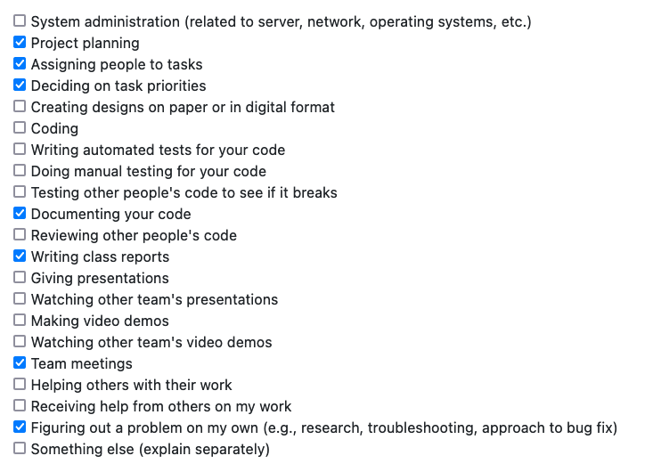

### 🎯 Work Summary

-   planned all project milestones, tasks
-   determined project features
-   completed project proposal
-   delegated tasks across team
-   led meetings with team

### 🗒️ Additional Notes

No additional notes.

## 📅 October 02 – October 08, 2023

### 📋 Tasks Completed

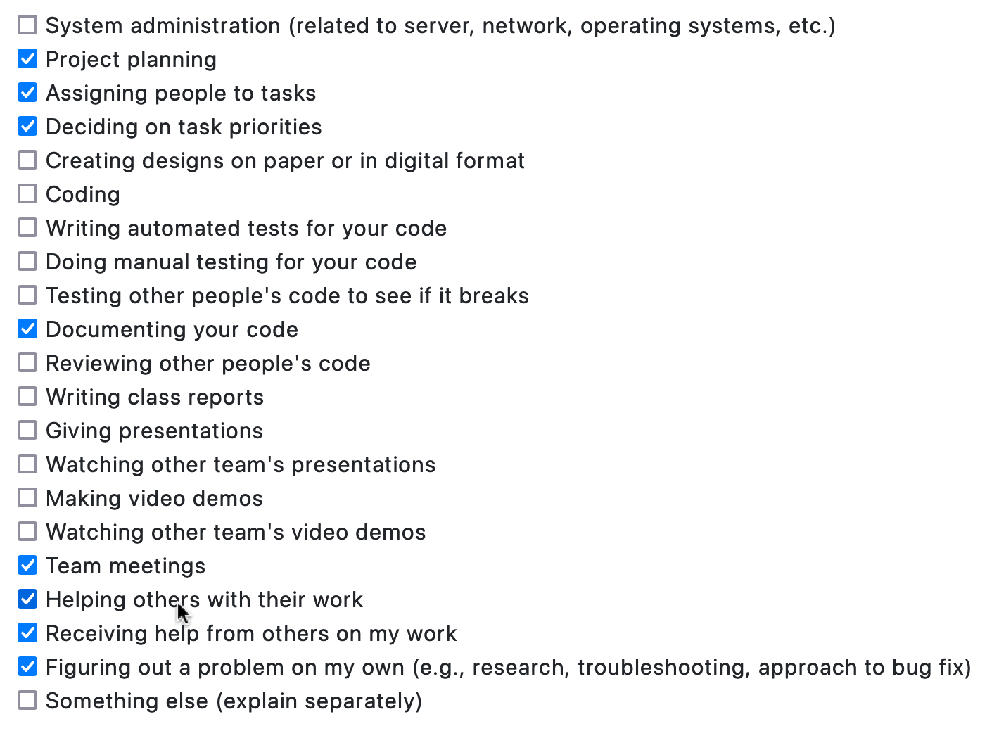

### 🎯 Work Summary

-   set up nextjs experimentation environment for everyone
-   prepared patternfly and docker integration for this nextjs environment
-   organized meetings for team
-   prepared standardization document for git and comments
-   directed members to begin work on specific tasks in timeline
-   discussed possibility of live service after AWS email from Bowen

### 🗒️ Additional Notes

No additional notes.

## 📅 October 09 – October 15, 2023

### 📋 Tasks Completed

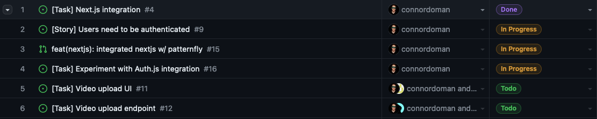

### 🎯 Work Summary

-   exploring use of Auth.js for authentication
-   PR'd nextjs front-end boilerplate to repo
-   code review
-   led team meeting
    -   discussed database schema
    -   discussed auth flow
    -   planned next week's tasking
    -   reviewed other's work leading to upcoming week 7 milestone (looking good)

### 🗒️ Additional Notes

All UI features dependent on front-end boilerplate, new work waiting on PR approval.

## 📅 October 16 – October 22, 2023

### 📋 Tasks Completed

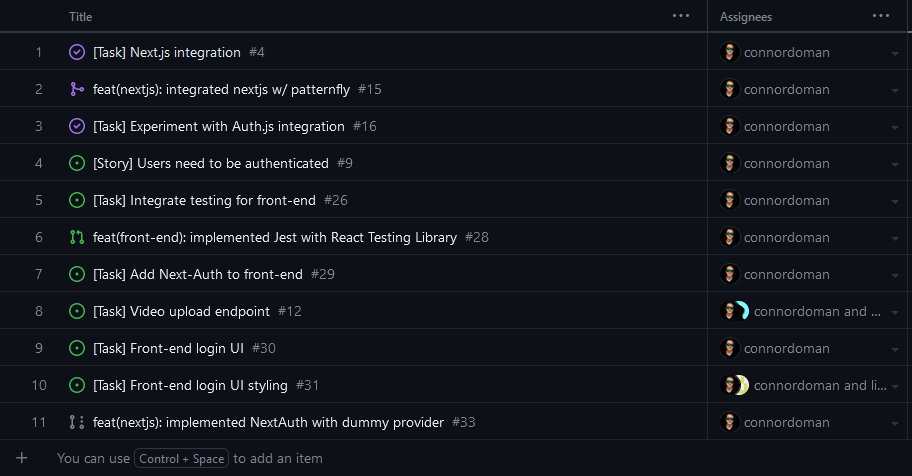

### 🎯 Work Summary

-   implemented `NextAuth` for user authentication
-   implemented `jest` and `@testing-library/react` for testing the front end
-   reviewed pull requests from Paul and Thuan
-   team meeting
    -   discussed auth flow
    -   distributed work for week 9 presentation
-   exploring use of `NextAuth` + `Cognito`

### 🗒️ Additional Notes

No additional notes.

## 📅 October 23 – October 29, 2023

### 📋 Tasks Completed

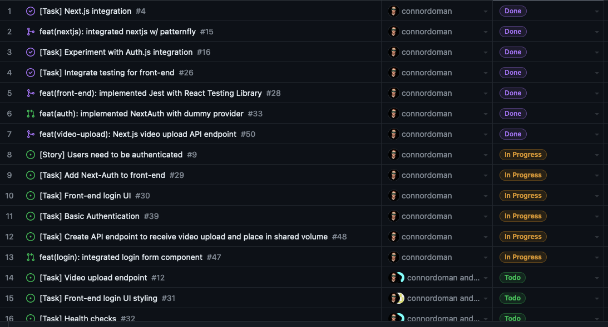

#

### 🎯 Work Summary

-   implemented Login form with page
-   implemented Custom Auth Provider
-   implemented site wide configs for users
-   contributed to styling of `<LoginForm/>` with Linh
-   debugged `<VideoUploadUI/>` component with Paul

### 🗒️ Additional Notes

No additional notes.

## 📅 October 23 – October 29, 2023

### 📋 Tasks Completed

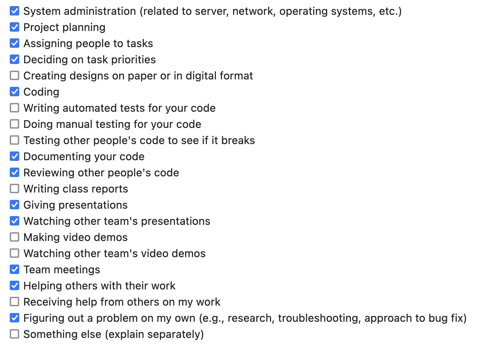

### 🎯 Work Summary

-   did mini presentation
-   restructured team
-   implemented Basic Authentication request handling
-   completed styling for `<VideoUploadUI/>`

### 🗒️ Additional Notes

No additional notes.

## 📅 November 6 - November 12, 2023

### 📋 Tasks Completed

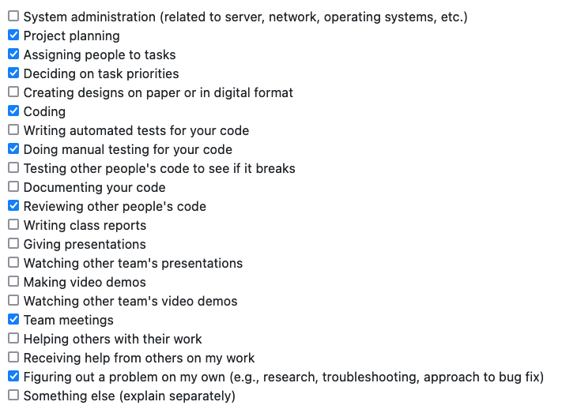

-   #80 -> feat(auth): API endpoint + middleware for basic auth

### 🎯 Work Summary

-   implemented encrypted user sessions with `iron-session`
-   implemented `Basic` auth protocol
-   researched methods for data fetching and caching in Next.js
-   introduced style document as a front end guideline

### 🗒️ Additional Notes

No additional notes.

## 📅 November 13 - November 26, 2023

### 📋 Tasks Completed

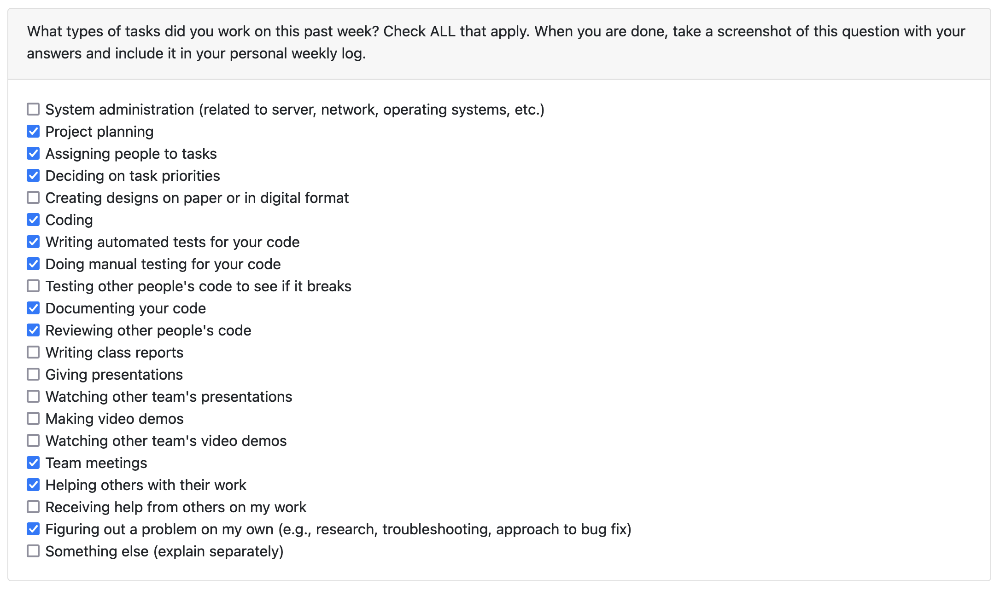

-   #126 -> feat(auth): support user sessions with iron-session
-   #151 -> feat(user): user account UI
-   #179 -> feat(tests): add Cypress for testing Next.js server features

### 🎯 Work Summary

-   PR'd user sessions
-   Created user account Ui (`/users/dashboard`)
-   Added Cypress E2E and integration tests
-   Distributed tasks for week 12 milestone and Design Document work
-   Helped developers with debugging my code and running dev environment

### 🗒️ Additional Notes

No additional notes.

## 📅 November 17 - December 3, 2023

### 📋 Tasks Completed

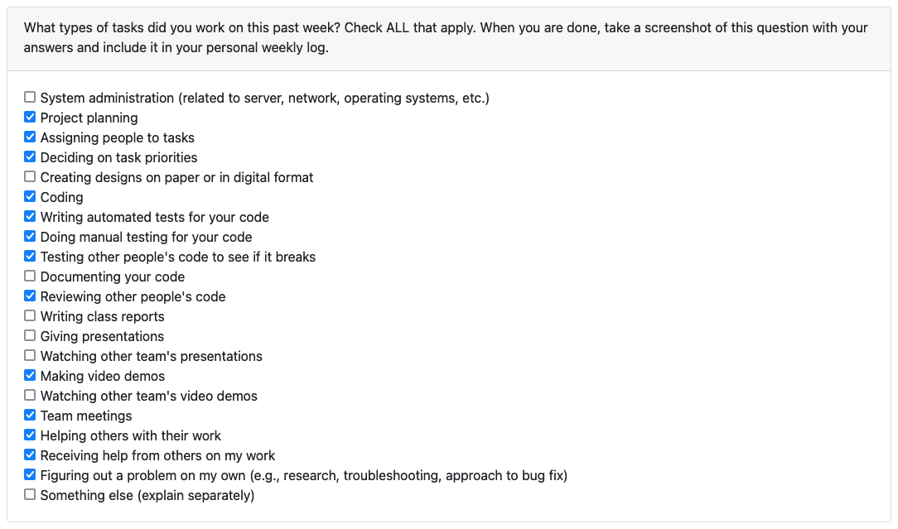

-   #210 -> feat(appointments): appointment creation UI
-   #228 -> chore(integration): video upload backend and front end
-   #238 -> fix(build): force /api/users/clients to be dynamic
-   #190 -> feat(video-review): add video review UI
-   #237 -> feat(tests): add e2e testing to catch up to Week 13

### 🎯 Work Summary

-   Planned design doc, design video
-   Integrated features in time for week 13
-   Recorded design video portion
-   Led team meeting

### 🗒️ Additional Notes

No additional notes.

## 📅 January 8 - January 14, 2023

### 📋 Tasks Completed

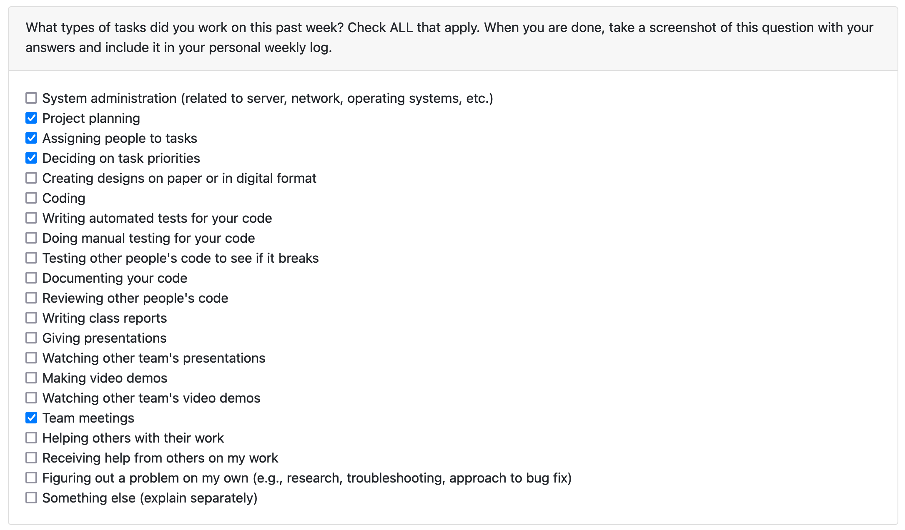

### 🎯 Work Summary

-   Planned week 4 deliverables
-   Discussed AWS migration
-   Led team meeting
-   Planned next week's deliverable goals

### 🗒️ Additional Notes

No additional notes.

## 📅 January 15 - January 21, 2023

### 📋 Tasks Completed

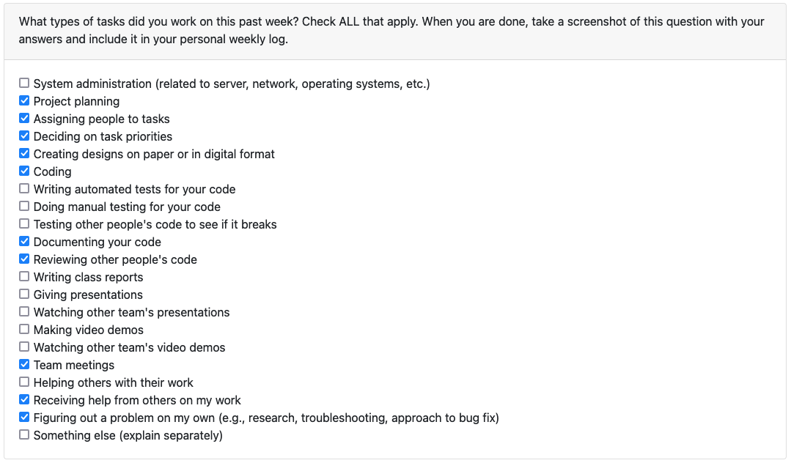

### 🎯 Work Summary

-   Prioritized week 4 tasks
-   Assigned developers to tasks
-   Led team meeting
-   Implemented health checks for Next.js
-   Some integration work for outdated code (auth actually checks database, passwords hashed, etc.)

### 🗒️ Additional Notes

No additional notes.

## 📅 January 22 - January 28, 2023

### 📋 Tasks Completed

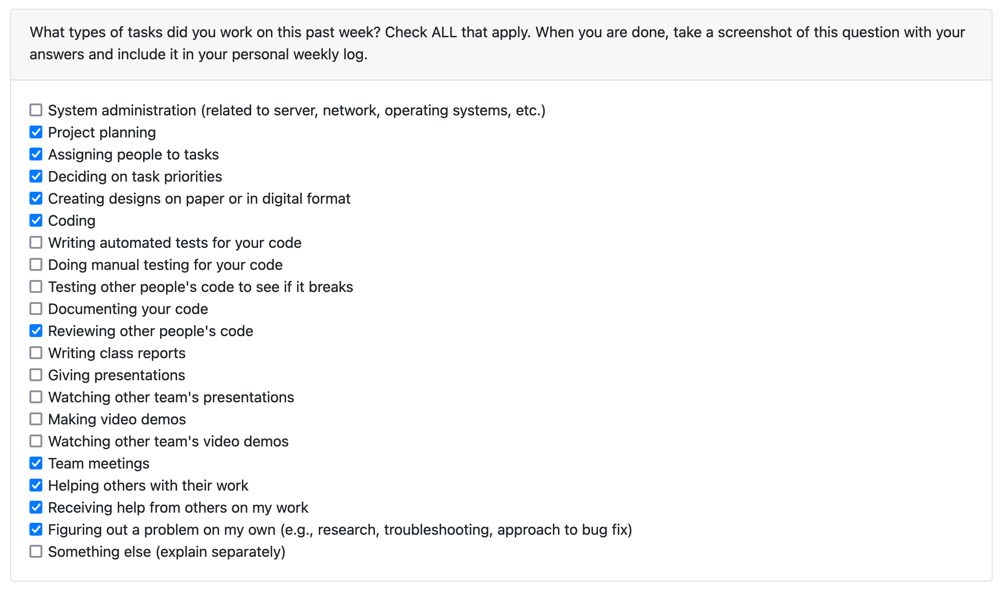

### 🎯 Work Summary

-   Finished health checks for Next.js (#351)
-   Finished integration refactoring for video upload flow (#393)
-   Created DELETE route handler for deleting videos from appointments (#412)
-   Implemented "basic" auth scheme with NextAuth migration (#426)
-   Planned meetings
-   Planned peer testing
-   Created support docs for peer testing
-   Found some necessary later refactoring (NextAuth patterns, CSS and layout)

### 🗒️ Additional Notes

No additional notes.

## 📅 January 29 - February 4, 2023

### 📋 Tasks Completed

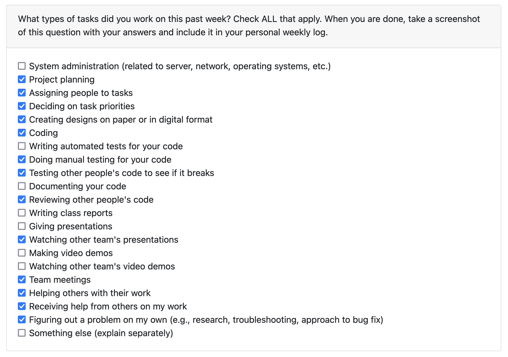

### 🎯 Work Summary

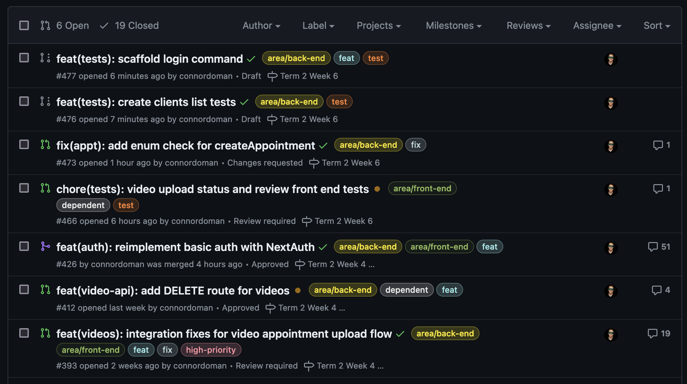

Additionally:

-   Led team meetings
-   Created plans and issues for upcoming features in following milestones
-   Helped organize team during peer testing

### 🗒️ Additional Notes

No additional notes.

## 📅 February 5 - February 11, 2023

### 📋 Tasks Completed

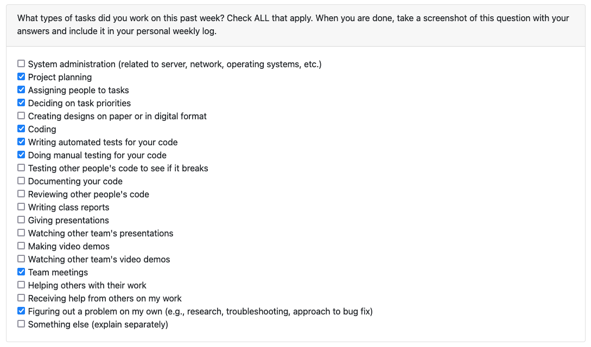

### 🎯 Work Summary

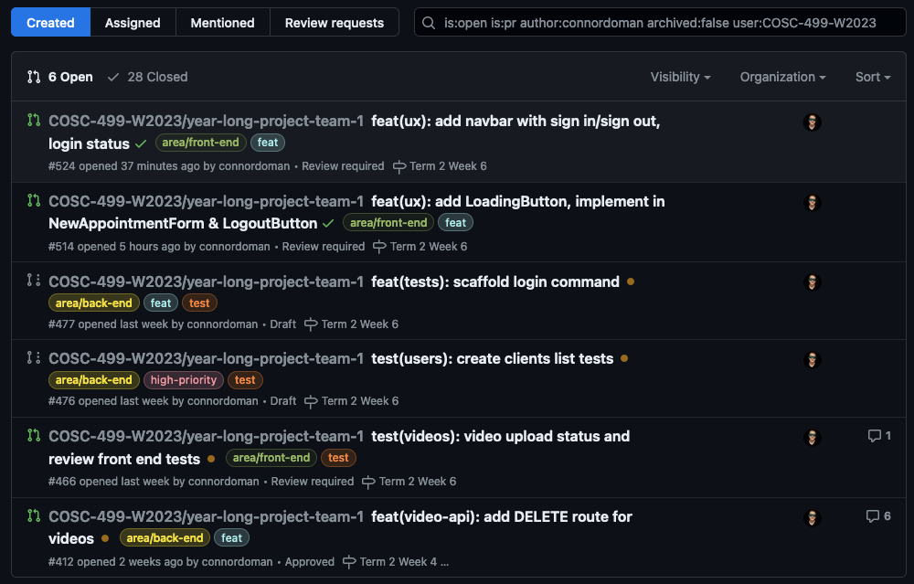

Additionally:

-   Led team meeting
-   Closed half a dozen dependabot alerts
-   Closed PR for issue #357 $\leftarrow$ no longer relevant

### 🗒️ Additional Notes

No additional notes.

## 📅 February 12 - February 18, 2023

### 📋 Tasks Completed

### 🎯 Work Summary

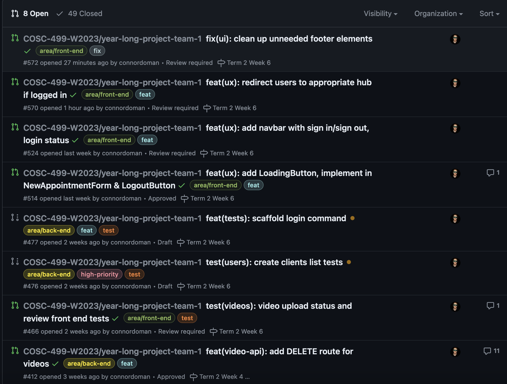

### 🗒️ Additional Notes

No additional notes.

## 📅 February 26 - March 3, 2023

### 📋 Tasks Completed

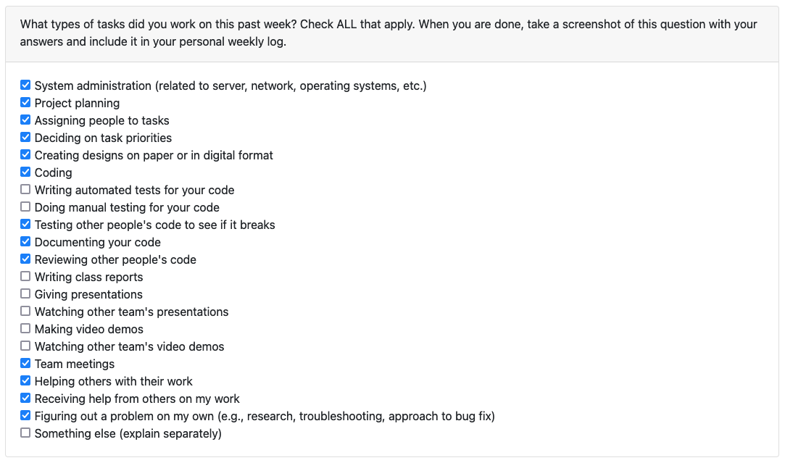

### 🎯 Work Summary

#### Pull Requests

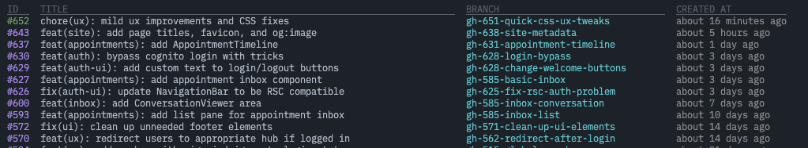

#### Preview

I made everything in this screenshort except the "Upload a Video" panel

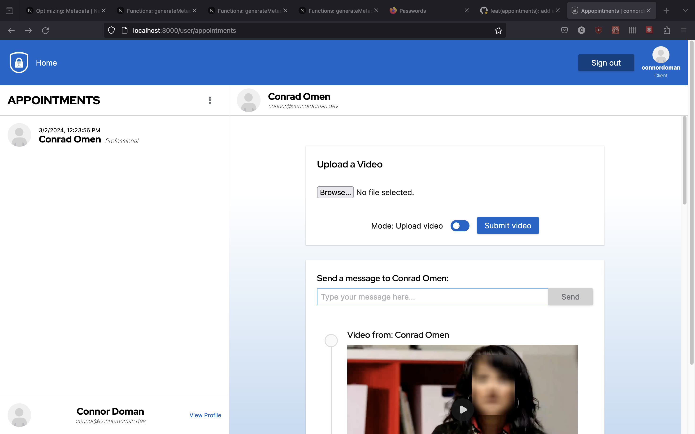

### 🗒️ Additional Notes

No additional notes.

## 📅 March 4 - March 10, 2023

### 📋 Tasks Completed

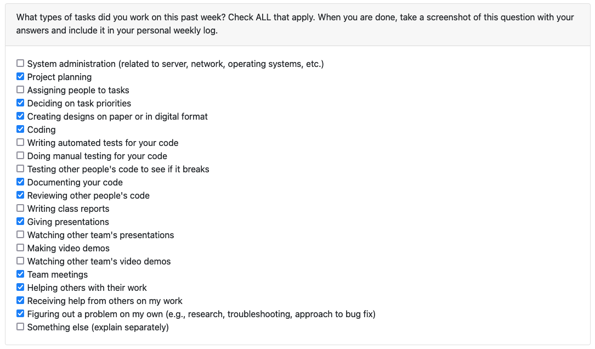

### 🎯 Work Summary

Our region selection component was very outdated (did not support React 18). To avoid publishing outdated dependencies to the project, I reimplemented the library and added support for React 18 and TypeScript. I created this as a separate repository and published to NPM for portability and to make integration more straghtforward. Here is that repo: [https://github.com/connordoman/react-region-select-2](https://github.com/connordoman/react-region-select-2)

#### Pull Requests

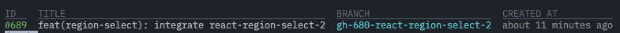

### 🗒️ Additional Notes

No additional notes.

## 📅 March 11 - March 17, 2023

### 📋 Tasks Completed

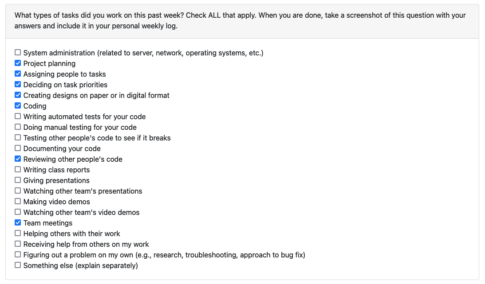

### 🎯 Work Summary

-   Followed up with the team about some UI/UX aspects of my component
-   Planned team work, team meeting

#### Pull Requests

PRs unchanged from last weekend.

### 🗒️ Additional Notes

No additional notes.

## 📅 March 18 - March 24, 2023

### 📋 Tasks Completed

### 🎯 Work Summary

-   Finished video upload wizard
    -   Designed to improve UX for uploading/recording and blurring videos
-   Added a "cancel processing" button to prevent dangling uploads
-   Added delete button and API route to messages in timeline for appointments

#### Pull Requests

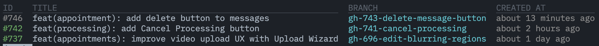

### 🗒️ Additional Notes

No additional notes.
