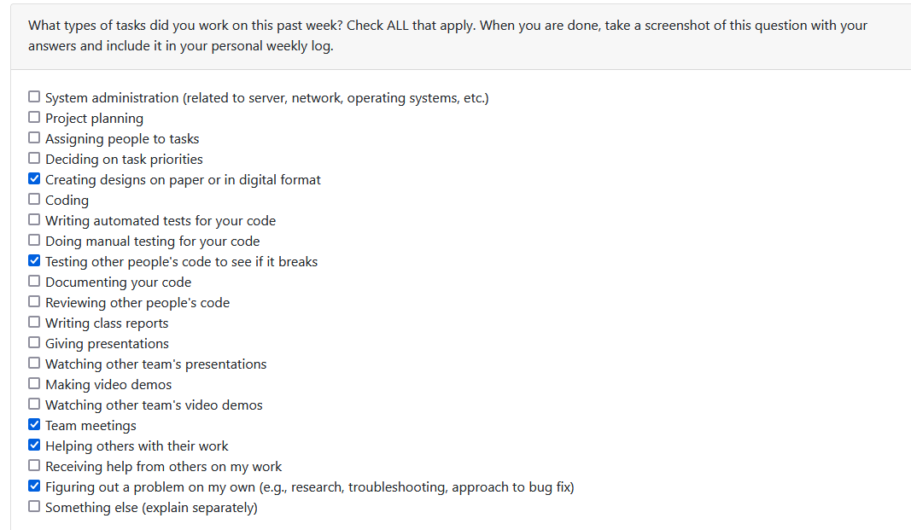
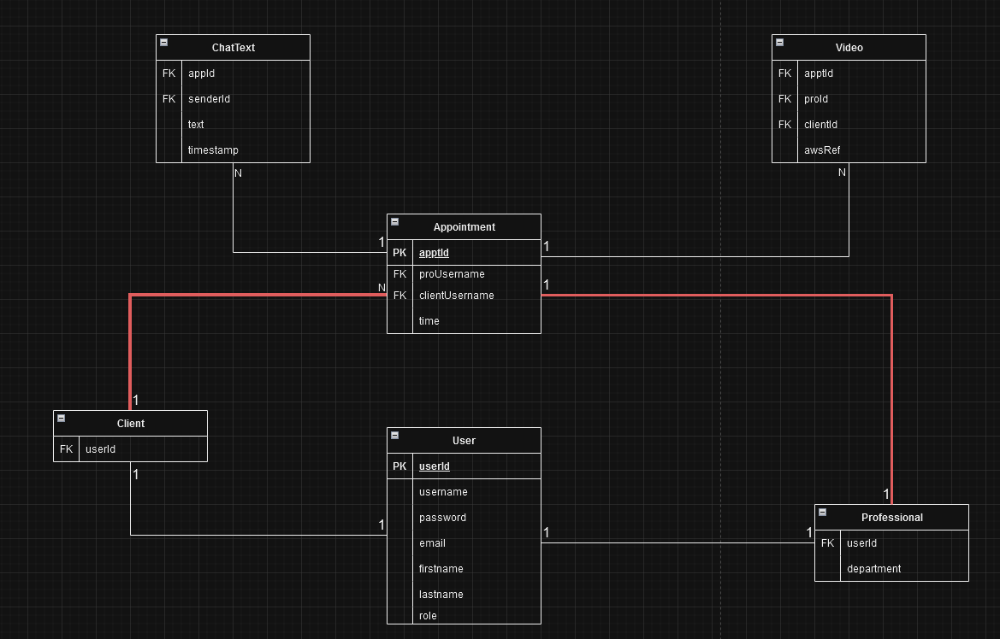
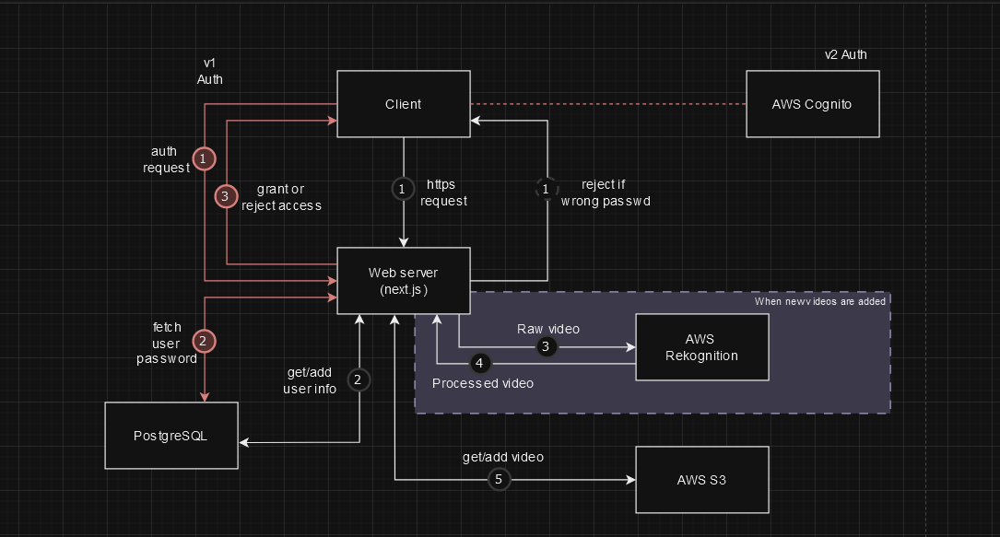

# Personal Log for Ngan_Phan (Team 1)

## 📅 September 25, 2023 - October 1, 2023

### 📋 Tasks Completed

### 🎯 Work Summary

- Attend meetings.
- Look into data storage structure.
- Refine project plan.

### 🗒️ Additional Notes

No additional notes.

## 📅 October 2, 2023 - October 8, 2023

### 📋 Tasks Completed

### 🎯 Work Summary

- Attend meetings, finalize code practice plan
- Started designing ER for database
- Read postgresql document

### 🗒️ Additional Notes

No additional notes.

## 📅 October 9, 2023 - October 15, 2023

### 📋 Tasks Completed

### 🎯 Work Summary

- Attended meetings.
- Worked on ER design.
- Looked into AWS Cognito.
- Drafted system architecture design.
### 🗒️ Additional Notes
#### ER Design

#### System architecture diagram

