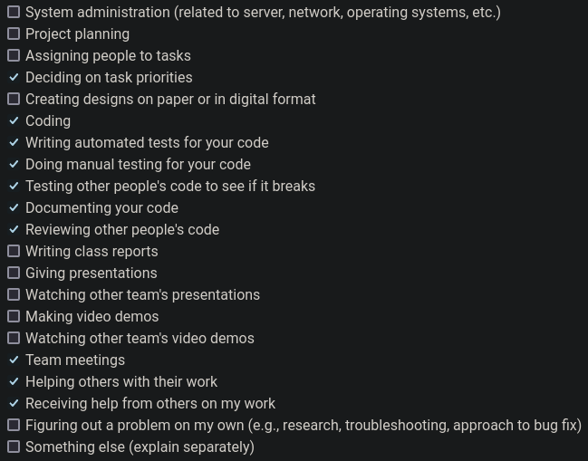

# Personal Log for Paul (Team 1)

## 📅 September 25, 2023 - October 1, 2023

### 📋 Tasks Completed

### 🎯 Work Summary

-   brainstorming features and breaking down tasks
-   refining tech stack
-   project plan document

### 🗒️ Additional Notes

No additional notes.

## 📅 October 2, 2023 - October 8, 2023

### 📋 Tasks Completed

### 🎯 Work Summary

-   started learning next.js and the react framework
-   started working on some temp files locally for the video processing backend
-   finalized some git workflow and documentation standards for our project

### 🗒️ Additional Notes

No additional notes.

## 📅 October 9, 2023 - October 15, 2023

### 📋 Tasks Completed

### 🎯 Work Summary

-   made improvements to the video processing backend
-   pushed changes to git on gh-12-* branch
-   looked at ER design and suggested changes during team meeting

### 🗒️ Additional Notes

No additional notes.

## 📅 October 16, 2023 - October 22, 2023

### 📋 Tasks Completed

-   #12 -> video upload endpoint

### 🎯 Work Summary

-   refined video processing server, broke it out into a class with a runnable main() method
-   added functionality for watching a folder and running processing jobs when new files are added
-   added functionality for http POST requests to start processing jobs
-   added full interpolated video processing integration with AWS rekognition
-   wrote some basic tests

### 🗒️ Additional Notes

No additional notes.

## 📅 October 23, 2023 - October 29, 2023

### 📋 Tasks Completed

-   #43 -> fixed a bug where ffmpeg wouldn't always run
-   #46 -> assisted in debugging permissions on video processing server build
-   #11 -> video upload ui

### 🎯 Work Summary

-   assisted Thuan with video processing build issues
-   worked on the backend server and fleshed out our Flask implementation
-   added tests for the Flask server and updated tests for the video processing server
-   made a draft video upload UI

### 🗒️ Additional Notes

No additional notes.

