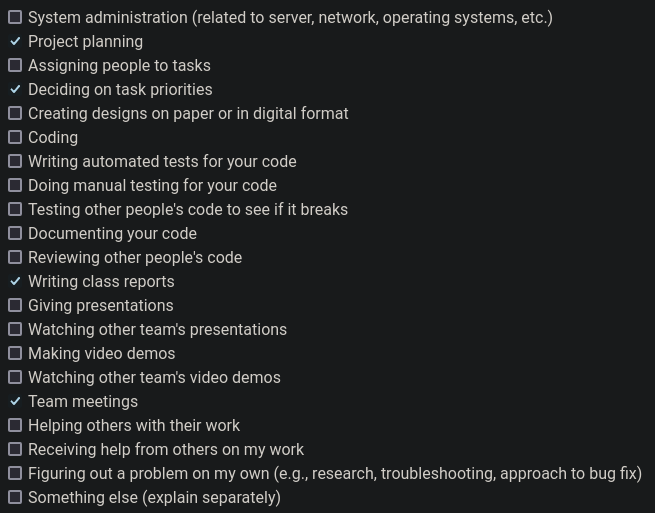
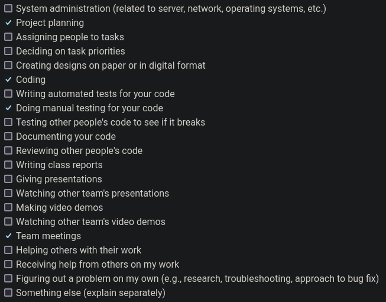
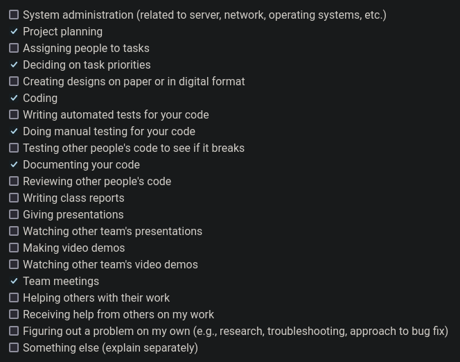

# Personal Log for Paul (Team 1)

## 📅 September 25, 2023 - October 1, 2023

### 📋 Tasks Completed

### 🎯 Work Summary

-   brainstorming features and breaking down tasks
-   refining tech stack
-   project plan document

### 🗒️ Additional Notes

No additional notes.

## 📅 October 2, 2023 - October 8, 2023

### 📋 Tasks Completed

### 🎯 Work Summary

-   started learning next.js and the react framework
-   started working on some temp files locally for the video processing backend
-   finalized some git workflow and documentation standards for our project

### 🗒️ Additional Notes

No additional notes.

## 📅 October 9, 2023 - October 15, 2023

### 📋 Tasks Completed

### 🎯 Work Summary

-   made improvements to the video processing backend
-   pushed changes to git on gh-12-* branch
-   looked at ER design and suggested changes during team meeting

### 🗒️ Additional Notes

No additional notes.

