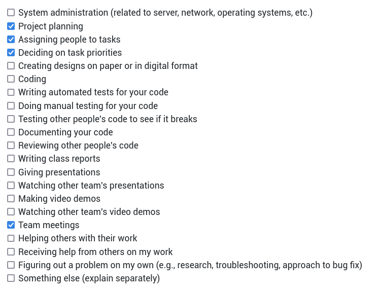
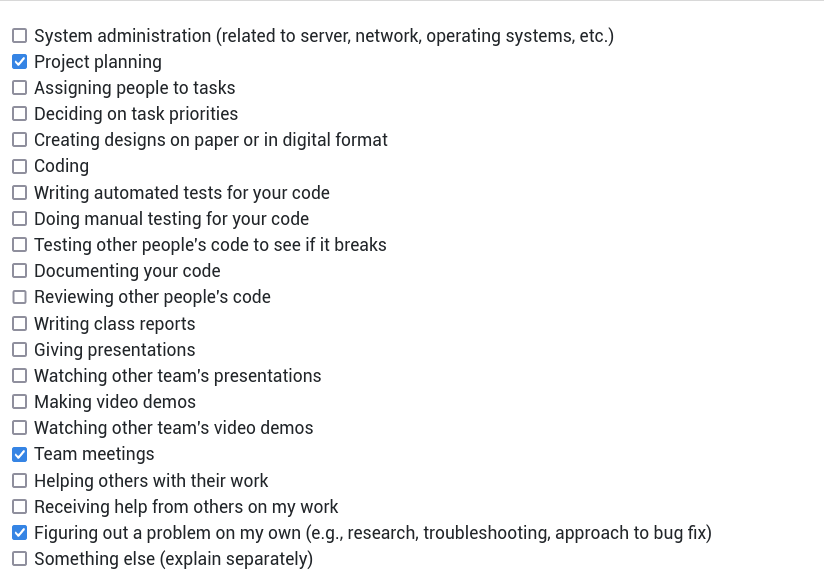

# Personal Log for Thuan_vo (Team 1)

## 📅 September 25, 2023 - October 1, 2023

### 📋 Tasks Completed

### 🎯 Work Summary

- Brainstorm project architectures.
- Refine tech stack for deployment (i.e. k8s).
- Attend meetings.
- Look into container image builds for Next.js.

### 🗒️ Additional Notes

No additional notes.

## 📅 October 2, 2023 - October 8, 2023

### 📋 Tasks Completed

### 🎯 Work Summary

- Discussion github workflows and git conventions.
- Attend meetings.
- Look into container image builds for Next.js.
- Research into operatorSDK and local development setup.

### 🗒️ Additional Notes

No additional notes.

