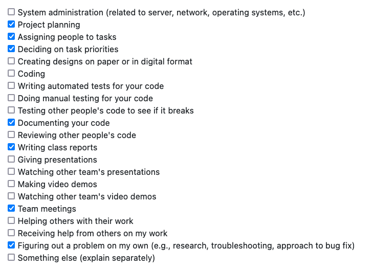
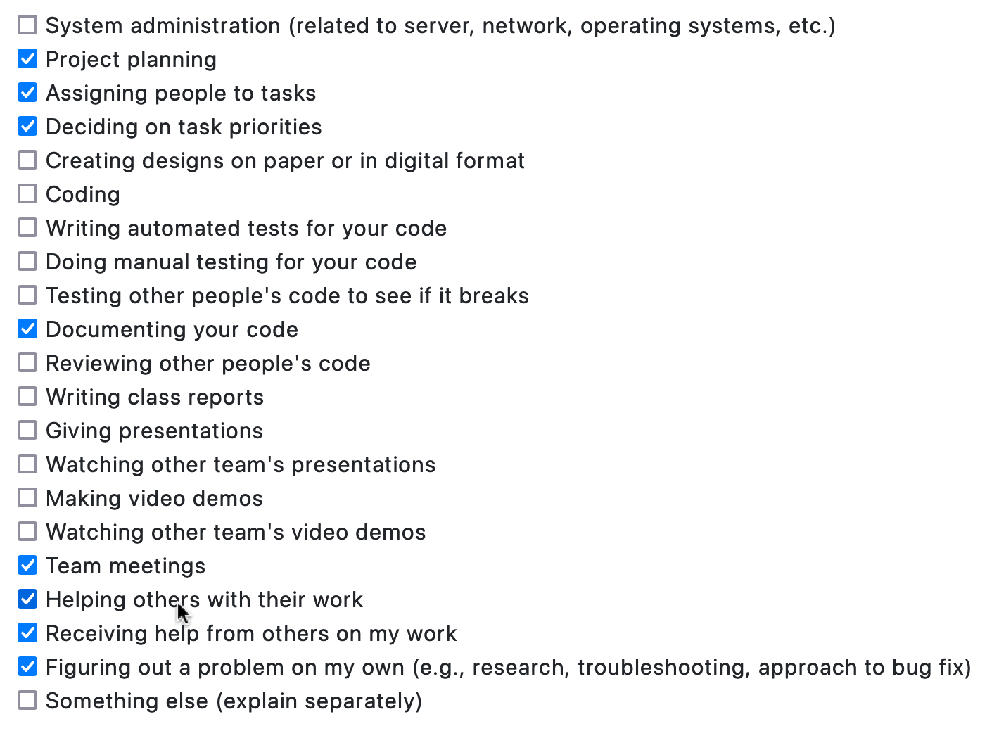
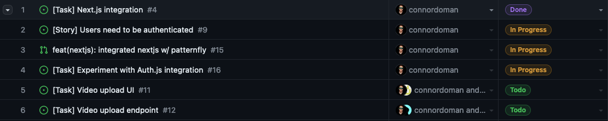

# Personal Log for Connor (Team 1)

## 📅 September 25 – October 01, 2023

### 📋 Tasks Completed

### 🎯 Work Summary

-   planned all project milestones, tasks
-   determined project features
-   completed project proposal
-   delegated tasks across team
-   led meetings with team

### 🗒️ Additional Notes

No additional notes.

## 📅 October 02 – October 08, 2023

### 📋 Tasks Completed

### 🎯 Work Summary

-   set up nextjs experimentation environment for everyone
-   prepared patternfly and docker integration for this nextjs environment
-   organized meetings for team
-   prepared standardization document for git and comments
-   directed members to begin work on specific tasks in timeline
-   discussed possibility of live service after AWS email from Bowen

### 🗒️ Additional Notes

No additional notes.

## 📅 October 09 – October 15, 2023

### 📋 Tasks Completed

### 🎯 Work Summary

-   exploring use of Auth.js for authentication
-   PR'd nextjs front-end boilerplate to repo
-   code review
-   led team meeting
    -   discussed database schema
    -   discussed auth flow
    -   planned next week's tasking
    -   reviewed other's work leading to upcoming week 7 milestone (looking good)

### 🗒️ Additional Notes

All UI features dependent on front-end boilerplate, new work waiting on PR approval.
