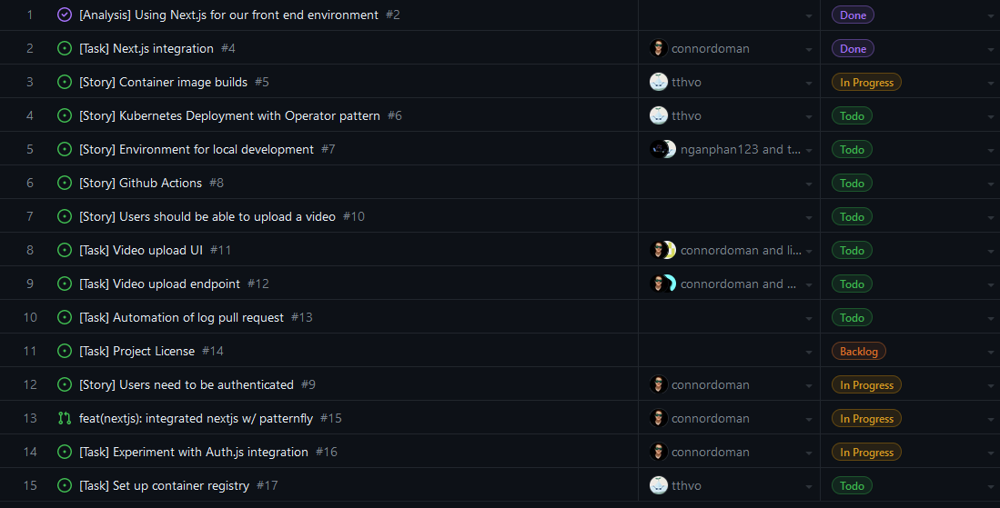

# Weekly Log for Team 1

## 📅 September 25th - October 1st

### 🏅 Team Members

-   Connor Doman (connordoman)
-   Linh Nguyen (linhnnk)
-   Ngan Phan (nganphan123)
-   Paul Unger (MyStackOverflows)
-   Thuan Vo (tthvo)

### 🎯 Work Summary

-   Meetings with team
-   Determined project features
-   Planned all project milestones, tasks
-   Delegated tasks across team
-   Completed project proposal

### 📋 Milestone Review

0th milestone complete:

    Project proposal and plan created, submitted.

### 📈 Burnup Chart

N/A for this week.

### 🧾 Tasks

No GitHub issues/tasks were created this week.

### 🔧 Testing

N/A for this week.

### 🗒️ Additional Notes

No additional notes.

## 📅 October 2, 2023 - October 8, 2023

### 🏅 Team Members

-   Connor Doman (connordoman)
-   Linh Nguyen (linhnnk)
-   Ngan Phan (nganphan123)
-   Paul Unger (MyStackOverflows)
-   Thuan Vo (tthvo)

### 🎯 Work Summary

-   Meetings with team.
-   Discussed github workflow and git conventions.
-   Research into tech stacks.
-   Reconsider project proposal after new requests were sent. Those requests will be marked as stretch goals.

### 📋 Milestone Review

0th milestone complete:

    Git convention and workflow discussed and agreed.

### 📈 Burnup Chart

N/A for this week.

### 🧾 Tasks

No GitHub issues/tasks were created this week.

### 🔧 Testing

N/A for this week.

### 🗒️ Additional Notes

No additional notes.

## 📅 October 9, 2023 - October 15, 2023

### 🏅 Team Members

-   Connor Doman (connordoman)
-   Linh Nguyen (linhnnk)
-   Ngan Phan (nganphan123)
-   Paul Unger (MyStackOverflows)
-   Thuan Vo (tthvo)

### 🎯 Work Summary

-   Meetings with team.
-   Dicussed database schema for login
-   Discussed general data schema
-   Backend testing for lambdas vs local processing
-   Containerization discussion -> NextJS next week
-   Presented UI design for login
-   Organized group files and folders

### 📋 Milestone Review

No milestones completed this week.

Discussed and distributed work needed for milestone 1 (week 7).

### 📈 Burnup Chart

N/A for this week.

### 🧾 Tasks

### 🔧 Testing

N/A for this week.

### 🗒️ Additional Notes

No additional notes.
