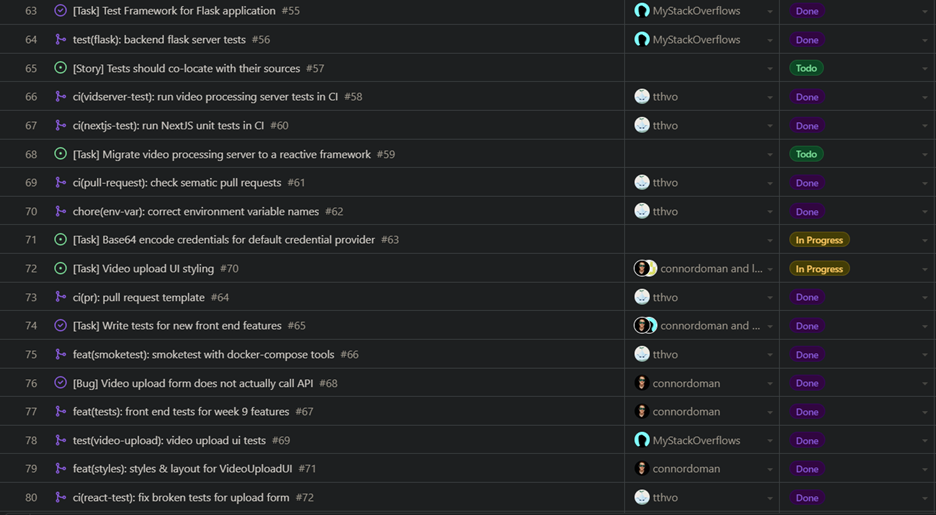
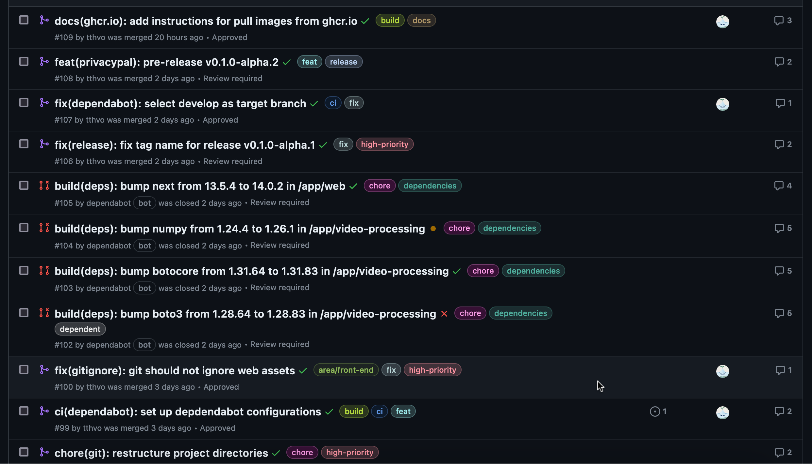
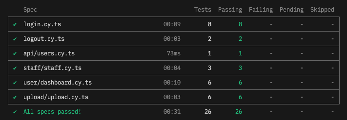
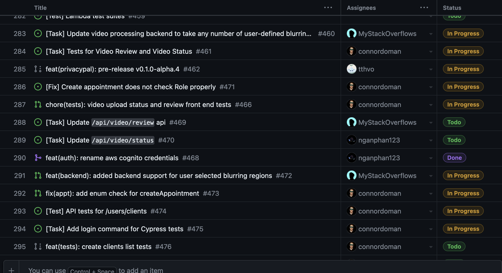

# Weekly Log for Team 1

## 📅 September 25th - October 1st

### 🏅 Team Members

-   Connor Doman (connordoman)
-   Linh Nguyen (linhnnk)
-   Ngan Phan (nganphan123)
-   Paul Unger (MyStackOverflows)
-   Thuan Vo (tthvo)

### 🎯 Work Summary

-   Meetings with team
-   Determined project features
-   Planned all project milestones, tasks
-   Delegated tasks across team
-   Completed project proposal

### 📋 Milestone Review

0th milestone complete:

    Project proposal and plan created, submitted.

### 📈 Burnup Chart

N/A for this week.

### 🧾 Tasks

No GitHub issues/tasks were created this week.

### 🔧 Testing

N/A for this week.

### 🗒️ Additional Notes

No additional notes.

## 📅 October 2, 2023 - October 8, 2023

### 🏅 Team Members

-   Connor Doman (connordoman)
-   Linh Nguyen (linhnnk)
-   Ngan Phan (nganphan123)
-   Paul Unger (MyStackOverflows)
-   Thuan Vo (tthvo)

### 🎯 Work Summary

-   Meetings with team.
-   Discussed github workflow and git conventions.
-   Research into tech stacks.
-   Reconsider project proposal after new requests were sent. Those requests will be marked as stretch goals.

### 📋 Milestone Review

0th milestone complete:

    Git convention and workflow discussed and agreed.

### 📈 Burnup Chart

N/A for this week.

### 🧾 Tasks

No GitHub issues/tasks were created this week.

### 🔧 Testing

N/A for this week.

### 🗒️ Additional Notes

No additional notes.

## 📅 October 9, 2023 - October 15, 2023

### 🏅 Team Members

-   Connor Doman (connordoman)
-   Linh Nguyen (linhnnk)
-   Ngan Phan (nganphan123)
-   Paul Unger (MyStackOverflows)
-   Thuan Vo (tthvo)

### 🎯 Work Summary

-   Meetings with team.
-   Dicussed database schema for login
-   Discussed general data schema
-   Backend testing for lambdas vs local processing
-   Containerization discussion -> NextJS next week
-   Presented UI design for login
-   Organized group files and folders

### 📋 Milestone Review

No milestones completed this week.

Discussed and distributed work needed for milestone 1 (week 7).

### 📈 Burnup Chart

N/A for this week.

### 🧾 Tasks

### 🔧 Testing

N/A for this week.

### 🗒️ Additional Notes

No additional notes.

## 📅 October 16, 2023 - October 22, 2023

### 🏅 Team Members

-   Connor Doman (connordoman)
-   Linh Nguyen (linhnnk)
-   Ngan Phan (nganphan123)
-   Paul Unger (MyStackOverflows)
-   Thuan Vo (tthvo)

### 🎯 Work Summary

-   Meetings with team.
    -   Discussed auth flow
    -   Discussed methods for facial recognition
-   Implemented back end facial recognition
-   Implemented front end authentication
-   Implemented front end testing
-   Created build pipeline for front end
-   Planned work required for week 9 presentation

### 📋 Milestone Review

    Milestone 1 (week 7) complete:

    The web, database, and video servers must all be scaffolded and reachable in a dev environment.

    Figma/UI Design scaffolded.

### 📈 Burnup Chart

> At the time of writing multiple PRs are waiting for review, will be merged before class next week.

### 🧾 Tasks

### 🔧 Testing

Video processing server tests:

    test_blur_frame (__main__.VideoProcessorTest.test_blur_frame) ... ok
    test_calc_vector_size (__main__.VideoProcessorTest.test_calc_vector_size) ... ok
    test_get_face (__main__.VideoProcessorTest.test_get_face) ... ok
    test_get_frames (__main__.VideoProcessorTest.test_get_frames) ... ok
    test_img_to_bytes (__main__.VideoProcessorTest.test_img_to_bytes) ... ok

    ----------------------------------------------------------------------
    Ran 5 tests in 0.550s

    OK

Tests N/A for front-end this week.

### 🗒️ Additional Notes

No additional notes.

## 📅 October 23, 2023 - October 29, 2023

### 🏅 Team Members

-   Connor Doman (connordoman)
-   Linh Nguyen (linhnnk)
-   Ngan Phan (nganphan123)
-   Paul Unger (MyStackOverflows)
-   Thuan Vo (tthvo)

### 🎯 Work Summary

-   Meetings with team.
-   Implemented back end web server for communication with front-end
-   Implemented container builds for NextJS and the video processing server
-   Implemented tests for back end web server
-   Continued UI designs
-   Planned week 9 presentation

### 📋 Milestone Review

    Presentation milestone: Users can log in and upload a video
    Complete.

### 📈 Burnup Chart

> At the time of writing multiple PRs are waiting for review, will be merged before class next week.

### 🧾 Tasks

### 🔧 Testing

Tests N/A for front-end this week.

### 🗒️ Additional Notes

No additional notes.

## 📅 October 30, 2023 - November 05, 2023

### 🏅 Team Members

-   Connor Doman (connordoman)
-   Linh Nguyen (linhnnk)
-   Ngan Phan (nganphan123)
-   Paul Unger (MyStackOverflows)
-   Thuan Vo (tthvo)

### 🎯 Work Summary

-   Meetings with team.
    -   Team restructuring
    -   Discussed auth machanism
-   UI Design on Video Upload page
-   Implemented testing on front-end web server
-   Do mini presentation
-   Do mini presentation evaluations

### 📋 Milestone Review

    Milestone 2 (week 12) completed:

        Two features must be completed
    team-wide:
    1. Users can log in with username
    and password.
    - Login UI (basic)
    - User session stored and
    accessed in web server
    2. Videos can be uploaded to the
    video server
    - Video upload UI (basic)

        Additionally, our UI theme (colors, fonts, borders, etc.) and our UI scheme (button placement, layout rules, etc.) will be mostly established.

### 📈 Burnup Chart

> At the time of writing multiple PRs are waiting for review, will be merged before class next week.

### 🧾 Tasks

### 🔧 Testing

### 🗒️ Additional Notes

No additional notes.

## 📅 November 06, 2023 - November 12, 2023

### 🏅 Team Members

-   Connor Doman (connordoman)
-   Linh Nguyen (linhnnk)
-   Ngan Phan (nganphan123)
-   Paul Unger (MyStackOverflows)
-   Thuan Vo (tthvo)

### 🎯 Work Summary

-   Meetings with team.
    -   Light discussion on feature implementation techniques
-   First major alpha release to `master`
-   Migrated video processing server to `quart`
-   Integrated PostgreSQL database with Next.js
-   Implemented `Basic` auth protocol in Next.js

### 📋 Milestone Review

Working on:

    Term 1 week 12: Ready for demo showcase following week

### 📈 Burnup Chart

### 🧾 Tasks

### 🔧 Testing

    test_health (test_server.ServerTest) ... /Users/connordoman/opt/miniconda3/lib/python3.9/unittest/case.py:550: RuntimeWarning: coroutine 'ServerTest.test_health' was never awaited
    method()
    RuntimeWarning: Enable tracemalloc to get the object allocation traceback
    ok
    test_health_method_not_allowed (test_server.ServerTest) ... /Users/connordoman/opt/miniconda3/lib/python3.9/unittest/case.py:550: RuntimeWarning: coroutine 'ServerTest.test_health_method_not_allowed' was never awaited
    method()
    RuntimeWarning: Enable tracemalloc to get the object allocation traceback
    ok
    test_process_video_file_found (test_server.ServerTest) ... /Users/connordoman/opt/miniconda3/lib/python3.9/unittest/case.py:550: RuntimeWarning: coroutine 'ServerTest.test_process_video_file_found' was never awaited
    method()
    RuntimeWarning: Enable tracemalloc to get the object allocation traceback
    ok
    test_process_video_file_not_found (test_server.ServerTest) ... /Users/connordoman/opt/miniconda3/lib/python3.9/unittest/case.py:550: RuntimeWarning: coroutine 'ServerTest.test_process_video_file_not_found' was never awaited
    method()
    RuntimeWarning: Enable tracemalloc to get the object allocation traceback
    ok
    test_process_video_method_not_allowed (test_server.ServerTest) ... /Users/connordoman/opt/miniconda3/lib/python3.9/unittest/case.py:550: RuntimeWarning: coroutine 'ServerTest.test_process_video_method_not_allowed' was never awaited
    method()
    RuntimeWarning: Enable tracemalloc to get the object allocation traceback
    ok
    test_calc_vector_size (test_video_processor.VideoProcessorTest) ... ok
    test_get_frames (test_video_processor.VideoProcessorTest) ... ok
    test_img_to_bytes (test_video_processor.VideoProcessorTest) ... ok

    ----------------------------------------------------------------------
    Ran 8 tests in 0.337s

    OK

### 🗒️ Additional Notes

No additional notes.

## 📅 November 13, 2023 - November 26, 2023

### 🏅 Team Members

-   Connor Doman (connordoman)
-   Linh Nguyen (linhnnk)
-   Ngan Phan (nganphan123)
-   Paul Unger (MyStackOverflows)
-   Thuan Vo (tthvo)

### 🎯 Work Summary

-   Meetings with team.
    -   Light discussion on feature implementation techniques
-   Planned Design Doc submission
-   Database features integrated
-   User sessions
-   User account UI
-   User registration UI
-   Cypress E2E and integration tests
-   Video review backend features
-   Video processing control routes
-   Build optimizations
-   `alpha.3` release to `master`

### 📋 Milestone Review

Working on:

    Term 1 week 12: Ready for demo showcase following week

### 📈 Burnup Chart

### 🧾 Tasks

More available at: [https://github.com/orgs/COSC-499-W2023/projects/26/views/2](https://github.com/orgs/COSC-499-W2023/projects/26/views/2)

### 🔧 Testing

    test_health (test_server.ServerTest) ... /Users/connordoman/opt/miniconda3/lib/python3.9/unittest/case.py:550: RuntimeWarning: coroutine 'ServerTest.test_health' was never awaited
    method()
    RuntimeWarning: Enable tracemalloc to get the object allocation traceback
    ok
    test_health_method_not_allowed (test_server.ServerTest) ... /Users/connordoman/opt/miniconda3/lib/python3.9/unittest/case.py:550: RuntimeWarning: coroutine 'ServerTest.test_health_method_not_allowed' was never awaited
    method()
    RuntimeWarning: Enable tracemalloc to get the object allocation traceback
    ok
    test_process_video_file_found (test_server.ServerTest) ... /Users/connordoman/opt/miniconda3/lib/python3.9/unittest/case.py:550: RuntimeWarning: coroutine 'ServerTest.test_process_video_file_found' was never awaited
    method()
    RuntimeWarning: Enable tracemalloc to get the object allocation traceback
    ok
    test_process_video_file_not_found (test_server.ServerTest) ... /Users/connordoman/opt/miniconda3/lib/python3.9/unittest/case.py:550: RuntimeWarning: coroutine 'ServerTest.test_process_video_file_not_found' was never awaited
    method()
    RuntimeWarning: Enable tracemalloc to get the object allocation traceback
    ok
    test_process_video_method_not_allowed (test_server.ServerTest) ... /Users/connordoman/opt/miniconda3/lib/python3.9/unittest/case.py:550: RuntimeWarning: coroutine 'ServerTest.test_process_video_method_not_allowed' was never awaited
    method()
    RuntimeWarning: Enable tracemalloc to get the object allocation traceback
    ok
    test_calc_vector_size (test_video_processor.VideoProcessorTest) ... ok
    test_get_frames (test_video_processor.VideoProcessorTest) ... ok
    test_img_to_bytes (test_video_processor.VideoProcessorTest) ... ok

    ----------------------------------------------------------------------
    Ran 8 tests in 0.337s

    OK

### 🗒️ Additional Notes

No additional notes.

## 📅 November 27, 2023 - December 3, 2023

### 🏅 Team Members

-   Connor Doman (connordoman)
-   Linh Nguyen (linhnnk)
-   Ngan Phan (nganphan123)
-   Paul Unger (MyStackOverflows)
-   Thuan Vo (tthvo)

### 🎯 Work Summary

-   Meetings with team.
-   Planned design doc, video
-   Created design doc, video
-   Integrated week 13 features
-   Added E2E tests for outstanding features
-   Added video review UI
-   Added video processing status UI
-   Added ability to push video to S3
-   Added database integration with users
-   Added database integration with appointments
-   Added appointment creation UI
-   Added user registration UI
-   Added user update UI
-   Added user password update UI
-   Added API routes for fetching user data
-   Added server actions for login and sessions

### 📋 Milestone Review

Working on:

    Term 1 Week 13: Design document and video

### 📈 Burnup Chart

### 🧾 Tasks

### 🔧 Testing

    test_health (test_server.ServerTest) ... /Users/connordoman/opt/miniconda3/lib/python3.9/unittest/case.py:550: RuntimeWarning: coroutine 'ServerTest.test_health' was never awaited
    method()
    RuntimeWarning: Enable tracemalloc to get the object allocation traceback
    ok
    test_health_method_not_allowed (test_server.ServerTest) ... /Users/connordoman/opt/miniconda3/lib/python3.9/unittest/case.py:550: RuntimeWarning: coroutine 'ServerTest.test_health_method_not_allowed' was never awaited
    method()
    RuntimeWarning: Enable tracemalloc to get the object allocation traceback
    ok
    test_process_video_file_found (test_server.ServerTest) ... /Users/connordoman/opt/miniconda3/lib/python3.9/unittest/case.py:550: RuntimeWarning: coroutine 'ServerTest.test_process_video_file_found' was never awaited
    method()
    RuntimeWarning: Enable tracemalloc to get the object allocation traceback
    ok
    test_process_video_file_not_found (test_server.ServerTest) ... /Users/connordoman/opt/miniconda3/lib/python3.9/unittest/case.py:550: RuntimeWarning: coroutine 'ServerTest.test_process_video_file_not_found' was never awaited
    method()
    RuntimeWarning: Enable tracemalloc to get the object allocation traceback
    ok
    test_process_video_method_not_allowed (test_server.ServerTest) ... /Users/connordoman/opt/miniconda3/lib/python3.9/unittest/case.py:550: RuntimeWarning: coroutine 'ServerTest.test_process_video_method_not_allowed' was never awaited
    method()
    RuntimeWarning: Enable tracemalloc to get the object allocation traceback
    ok
    test_calc_vector_size (test_video_processor.VideoProcessorTest) ... ok
    test_get_frames (test_video_processor.VideoProcessorTest) ... ok
    test_img_to_bytes (test_video_processor.VideoProcessorTest) ... ok

    ----------------------------------------------------------------------
    Ran 8 tests in 0.337s

    OK

### 🗒️ Additional Notes

No additional notes.

## 📅 January 15, 2024 - January 21, 2024

### 🏅 Team Members

-   Connor Doman (connordoman)
-   Linh Nguyen (linhnnk)
-   Ngan Phan (nganphan123)
-   Paul Unger (MyStackOverflows)
-   Thuan Vo (tthvo)

### 🎯 Work Summary

-   Meetings with team.
-   Planned for peer testing
-   Determined outstanding features for week 4
-   Discussed AWS migration more
-   Added health checks for Next.js
-   Proof of concept for AWS Lambda
-   Build and operator work for Lambda and otherwise

### 📋 Milestone Review

Working on:

    Term 2 Week 4: Peer Testing #1

### 📈 Burnup Chart

### 🧾 Tasks

Gonna be honest this list is not meaningful to show here. You're in the repo, please just check the project.

### 🔧 Testing

N/A for this week.

### 🗒️ Additional Notes

No additional notes.

## 📅 January 22, 2024 - January 28, 2024

### 🏅 Team Members

-   Connor Doman (connordoman)
-   Linh Nguyen (linhnnk)
-   Ngan Phan (nganphan123)
-   Paul Unger (MyStackOverflows)
-   Thuan Vo (tthvo)

### 🎯 Work Summary

-   Meetings with team.
-   Planned for peer testing
-   Added AWS lambda support for video processing
-   Added AWS cognito support for authentication
-   Added basic authentication support for next auth
-   Began UI redesign
-   Restructured build process, container upload
-   Provisioned AWS ROSA
-   Planned k8s deployment on AWS
-   API endpoints for appointments
-   API endpoints for users

### 📋 Milestone Review

Working on:

    Term 2 Week 4: Peer Testing #1

### 📈 Burnup Chart

### 🧾 Tasks

[Here is a link to the kanban board](https://github.com/orgs/COSC-499-W2023/projects/26)

### 🔧 Testing

N/A for this week.

### 🗒️ Additional Notes

No additional notes.

## 📅 January 29, 2024 - February 4, 2024

### 🏅 Team Members

-   Connor Doman (connordoman)
-   Linh Nguyen (linhnnk)
-   Ngan Phan (nganphan123)
-   Paul Unger (MyStackOverflows)
-   Thuan Vo (tthvo)

### 🎯 Work Summary

-   Conducted peer testing
-   Discussed and prioritized upcoming features for Week 6 milestone and Peer Testing #2
-   Added some outstanding tests
-   Worked on cloud deployment requirements
-   Updated some back end features for updated database schema
-   Added new UI components for displaying user data
-   Stabilized NextAuth middleware

### 📋 Milestone Review

Working on:

    Term 2 Week 6: Fixes from Peer Testing #1

### 📈 Burnup Chart

### 🧾 Tasks

[Here is a link to the kanban board](https://github.com/orgs/COSC-499-W2023/projects/26)

### 🔧 Testing

Added tests for:

-   Video upload review
-   Video upload status
-   AWS Lambda

(Tests reports are not available on this branch and I forgot to do them before switching ☹️)

### 🗒️ Additional Notes

No additional notes.

## 📅 February 5, 2024 - February 11, 2024

### 🏅 Team Members

-   Connor Doman (connordoman)
-   Linh Nguyen (linhnnk)
-   Ngan Phan (nganphan123)
-   Paul Unger (MyStackOverflows)
-   Thuan Vo (tthvo)

### 🎯 Work Summary

-   Focused on UI/UX fixes and build/deployment features this week
-   Added loading feedback to important buttons
-   Add navbar for user context
-   Fix AWS requisition problem re: recent client feedback
-   update video review API to cleanup videos based on user response
-   remove deprecated naming scheme for videos
-   add appointment management list for staff
-

### 📋 Milestone Review

Working on:

    Term 2 Week 6: Fixes from Peer Testing #1

### 📈 Burnup Chart

### 🧾 Tasks

[Here is a link to the kanban board](https://github.com/orgs/COSC-499-W2023/projects/26)

### 🔧 Testing

Additional Jest tests added for `LoadingButton` (passing, not shown here).

### 🗒️ Additional Notes

No additional notes.

## 📅 February 12, 2024 - February 18, 2024

### 🏅 Team Members

-   Connor Doman (connordoman)
-   Linh Nguyen (linhnnk)
-   Ngan Phan (nganphan123)
-   Paul Unger (MyStackOverflows)
-   Thuan Vo (tthvo)

### 🎯 Work Summary

-   Remove unneeded elements and streamline some UI interactions
-   Fix middleware authentication not applying for cognito
-   Redirect users to their "hub" when they login or try to navigate to `/`
-   Add frontend for recording video in browser
-   Developed lambda for video format conversion as backend to above ^
-   Added docs for said lambda
-   Fix card layout and appointment list structure.
-   Fix get video api
-   Fix video review frontend to work with new api updates
-   Tests for database initializer.

### 📋 Milestone Review

Working on:

    Term 2 Week 6: Fixes from Peer Testing #1

### 📈 Burnup Chart

### 🧾 Tasks

[Here is a link to the kanban board](https://github.com/orgs/COSC-499-W2023/projects/26)

### 🔧 Testing

Tests in `develop` have not changed since last week. There are outstanding tests in multiple PRs that haven't been merged

Database initializer now has both unit and integration tests, running continously on Github CI.

### 🗒️ Additional Notes

No additional notes.

## 📅 February 26, 2024 - March 3, 2024

### 🏅 Team Members

-   Connor Doman (connordoman)
-   Linh Nguyen (linhnnk)
-   Ngan Phan (nganphan123)
-   Paul Unger (MyStackOverflows)
-   Thuan Vo (tthvo)

### 🎯 Work Summary

-   Add appointment inbox
-   Add appointment timeline
-   Add appointment messages
-   Add optional face blurring
-   Add user-selectable blurring regions
-   Add hosted solution with Helm
-   Add backend features for timeline
-   Add backend features for messages
-   Fix auth routing issues
-   Many UX improvements

### 📋 Milestone Review

Working on:

    Term 2 Week 8: Peer Testing #2

### 📈 Burnup Chart

### 🧾 Tasks

[Here is a link to the kanban board](https://github.com/orgs/COSC-499-W2023/projects/26)

### 🔧 Testing

Database initializer now has both unit and integration tests, running continously on Github CI.

### 🗒️ Additional Notes

No additional notes.

## 📅 March 4, 2024 - March 10, 2024

### 🏅 Team Members

-   Connor Doman (connordoman)
-   Linh Nguyen (linhnnk)
-   Ngan Phan (nganphan123)
-   Paul Unger (MyStackOverflows)
-   Thuan Vo (tthvo)

### 🎯 Work Summary

-   Peer Testing 2
-   Fixing issues from peer testing
-   Discussed work breakdown for remaining weeks, planned QA phase
-   Added custom implementation of `react-region-select` for our project
-

### 📋 Milestone Review

Working on:

    Term 2 Week 12: Project Finalization

### 📈 Burnup Chart

### 🧾 Tasks

[Here is a link to the kanban board](https://github.com/orgs/COSC-499-W2023/projects/26)

### 🔧 Testing

No changes this week.

Database initializer now has both unit and integration tests, running continously on Github CI.

### 🗒️ Additional Notes

No additional notes.
